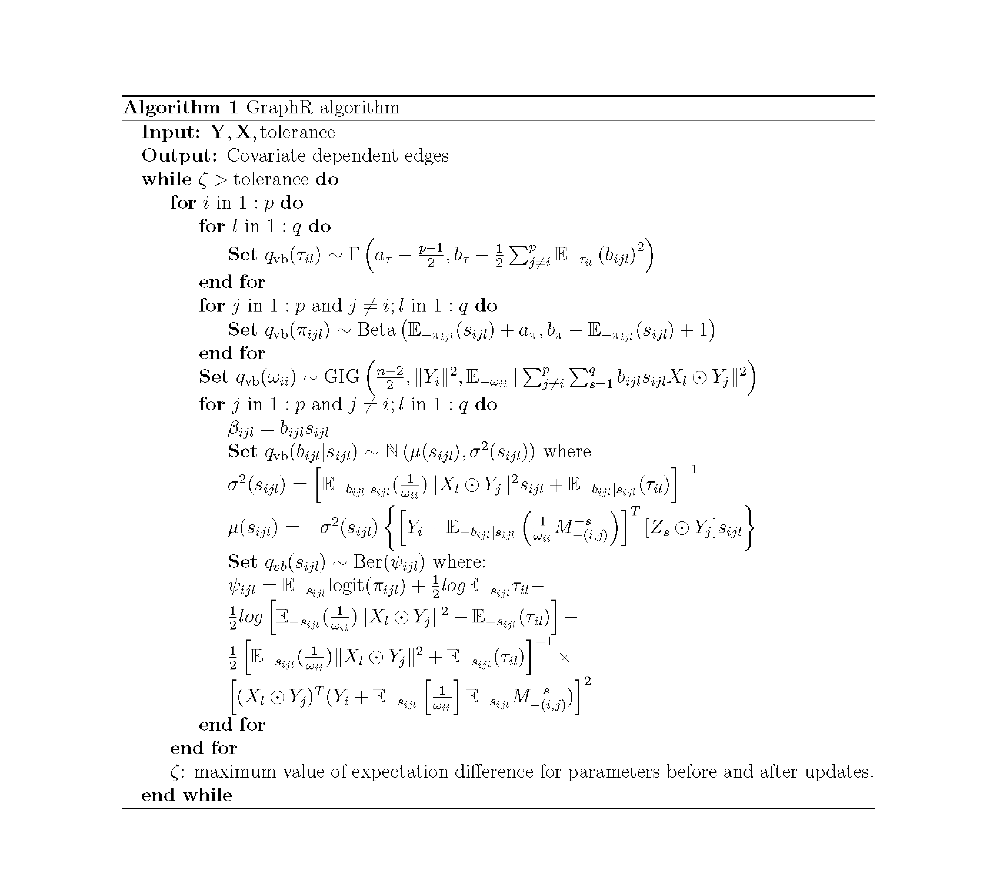

# Methodology {#method}
In this Section, we discuss the GraphR model and priors in Section \@ref(GraphRmodel) and brief introduction to variational Bayes inference method with mean-field assumption in Section \@ref(MFVB) followed by detailed derivation of the update equations and evidence lower bound (ELBO) for our GraphR model in Section \@ref(derivation) and Section \@ref(GraphElbo) respectively. In Section \@ref(GraphRcompare), we provide a comprehensive overview of the GraphR and competing methods. 

For notational purposes, we consider $\mathbf{Y} = (Y_1,...,Y_p) \in \mathbb{R}^ {N \times p} \sim \mathcal{N}(\mu,\Omega^{-1}(\mathbf{X}))$, where the precision matrix $\Omega(\mathbf{X}) = [\omega_{ij}(\mathbf{X})]_{p \times p}$ is a function of intrinsic factors $\mathbf{X}  = (X_1,...,X_q) \in \mathbb{R}^ {N \times q}$ and denote $\boldsymbol{\theta}$ as the parameters of estimation. Here $N$, $p$, $q$ denotes sample size, number of features and covariates respectively. 

<!-- Observed features are denoted as $\mathbf{Y} = (Y_1,...,Y_p)$ and intrinsic factors are $\mathbf{X}  = (X_1,...,X_q)$. We mention the details about the GraphR model in Section \@ref(GraphRmodel) followed by derivations of update equations and ELBO in Section \@ref(derivation) and Section \@ref(GraphElbo) respectively.   -->

## Model and priors {#GraphRmodel}
The GraphR model is expressed as follows: 
\begin{equation}
\begin{split}
&   Y_i = \sum_{j \neq i}^p \gamma_{ij}(\mathbf{X}) \odot Y_j + \epsilon_i, \hspace{0.5cm}  \epsilon_i \sim N(0,\frac{1}{\omega_{ii}}), \\
& \gamma_{ij}(X) = -\frac{\omega_{ij}(\mathbf{X})}{\omega_{ii}} = 
    -\frac{1}{\omega_{ii}} \mathbf{X} \boldsymbol{\beta_{ij}} = 
    -\frac{1}{\omega_{ii}} 
    \left(\sum_{l=1}^q \beta_{ijl}X_l \right)
\end{split}
(\#eq:graph-reg)
\end{equation}
where $\odot$ represents the element-wise multiplication between vectors.

<!-- We further denote parameter $\gamma_{ij}(X)$ as: -->
<!-- \begin{align}\label{eq:CIF} -->
<!--     \gamma_{ij}(X) = -\frac{\omega_{ij}(\mathbf{X})}{\omega_{ii}} =  -->
<!--     -\frac{1}{\omega_{ii}} \mathbf{X} \boldsymbol{\beta_{ij}} =  -->
<!--     -\frac{1}{\omega_{ii}}  -->
<!--     \left(\sum_{l=1}^q \beta_{ijl}X_l \right) -->
<!-- \end{align} -->

Priors on the GraphR model are given below:
\begin{align}
\begin{split}
&  \beta_{ijl} = b_{ijl} s_{ijl}, \\
&  b_{ijl} \mid \tau_{il} \sim N (0,\tau_{il}^{-1}), \\
&  s_{ijl} \mid \pi_{ijl} \sim \text{Ber}(\pi_{ijl}), \\
&    \tau_{il} \sim \text{Gamma}(a_\tau,b_\tau) \\
&    \pi_{ijl} \sim \text{Beta}(a_\pi,b_\pi) \\
& \omega_{ii} \propto 1. \\
\end{split}
(\#eq:spike-slab)
\end{align}

Parameters of estimation are $\boldsymbol{\theta} = \{ \boldsymbol{b,s,\omega,\pi,\tau}\}$.

## Mean field variational Bayes {#MFVB}
Varitional Bayes method aims to obtain the optimal approximation of true posterior distribution from a class of tractable distributions $Q$, called variational family, by minimizing the Kullback-Leibler (KL) divergence between the approximate $q_{\text{vb}}(\boldsymbol{\theta})$ and the true posterior distribution $p(\boldsymbol{\theta|\mathbf{Y,X}})$ [@attias2000speech]. A common choice of $Q$, known as mean-field approximation, assumes that $q_{\text{vb}}(\boldsymbol{\theta})$ can be expressed as $\prod_{k=1}^K q^k_{\text{vb}}(\boldsymbol{\theta_k})$ for some partition of $\boldsymbol{\theta}$. One can write $q_{\text{vb}}(\boldsymbol{\theta})$ as 

\begin{align}\label{eq:KL_div}
    & q_{\text{vb}}^{*}(\boldsymbol{\theta}) \in \text{arg} \underset{q_{\text{vb}}(\boldsymbol{\theta}) \in \mathbb{Q}}{\text{min}} \ KL(q_{\text{vb}}(\boldsymbol{\theta})\|p(\boldsymbol{\theta |Y,X})) \text{, where} \nonumber \\
    & KL(q_{\text{vb}}(\boldsymbol{\theta})\|p(\boldsymbol{\theta|Y,X})) = \int q_{\text{vb}}(\boldsymbol{\theta}) \text{ log} \left (\frac{q_{\text{vb}}(\boldsymbol{\theta})}{p(\boldsymbol{\theta|Y,X})}\right)d\boldsymbol{\theta} \nonumber \\
    & = - \int q_{\text{vb}}(\boldsymbol{\theta}) \text{ log} \left (\frac{p(\boldsymbol{\theta|Y,X})}{q_{\text{vb}}(\boldsymbol{\theta})}\right)d\boldsymbol{\theta} 
     = - \int q_{\text{vb}}(\boldsymbol{\theta}) \text{ log} \left (\frac{p(\boldsymbol{\theta,Y,X})}{q_{\text{vb}}(\boldsymbol{\theta})}\right)d\boldsymbol{\theta} + \text{ log} \left[ p(\boldsymbol{Y,X}) \right].
\end{align}

We denote $L[q_{\text{vb}}(\boldsymbol{\theta})] = \int q_{\text{vb}}(\boldsymbol{\theta}) \text{log} \left ( p(\boldsymbol{\theta,Y,X}) / q_{\text{vb}}(\boldsymbol{\theta}) \right)d\boldsymbol{\theta}$ which is the lower bound of the model log-likelihood, and write $KL(q_{\text{vb}}(\boldsymbol{\theta})\|p(\boldsymbol{\theta|Y,X})) = -L[q_{\text{vb}}(\boldsymbol{\theta})] + \text{ log} \left[ p(\boldsymbol{Y,X}) \right]$. Minimizing KL-divergence is equivalent to maximizing $L[q_{\text{vb}}(\boldsymbol{\theta})]$ since $\text{ log} \left[ p(\boldsymbol{Y,X}) \right]$ doesn't involve $\boldsymbol{\theta}$. We can further show that
\begin{align}\label{eq:lowerbound}
L[q_{\text{vb}}(\boldsymbol{\theta})] &= \int q_{\text{vb}}(\boldsymbol{\theta}) \left[ \text{ log }p(\boldsymbol{\theta,Y,X}) - \text{ log } q_{\text{vb}}(\boldsymbol{\theta}) \right] d\boldsymbol{\theta} \nonumber \\
& = \int q^{k}_{\text{vb}}(\boldsymbol{\theta_k})
\int \left[
\left(\text{ log }p(\boldsymbol{\theta,Y,X}) - \text{ log }q_{\text{vb}}(\boldsymbol{\theta_k})
\right) \right] \prod_{i \neq k} q_{\text{vb}}(\boldsymbol{\theta_i}) d\boldsymbol{\theta_{-k}}d\boldsymbol{\theta_k}  
\nonumber \\
& \text{  } -\int \sum_{i \neq k} \text{ log }q_{\text{vb}}(\boldsymbol{\theta_i}) \prod_{i \neq k} q_{\text{vb}}(\boldsymbol{\theta_i}) \int q_{\text{vb}}(\boldsymbol{\theta_k}) d\boldsymbol{\theta_{-k}}d\boldsymbol{\theta_k} 
\nonumber \\
&= \int q^{k}_{\text{vb}}(\boldsymbol{\theta_k})
\left[\mathbb{E}_{-k} (\text{ log }p(\boldsymbol{\theta,Y,X})) - 
\text{ log } q_{\text{vb}}(\boldsymbol{\theta_k})\right]
d\boldsymbol{\theta_k} - \text{const}  \nonumber \\
&=-KL(q^{k}_{\text{vb}}(\boldsymbol{\theta_k}) \| \text{ exp } \left[
\mathbb{E}_{-k} (\text{ log }p(\boldsymbol{\theta,Y,X}))
\right]).
\end{align}

Therefore, we have $q^{k}_{\text{vb}}(\boldsymbol{\theta_k}) \propto \text{ exp } \left[
\mathbb{E}_{-k} (\text{ log }p(\boldsymbol{\theta,Y,X}))
\right]$.

<!-- ## Method details {#GraphRmethod} -->
<!-- Observed features are denoted as $\mathbf{Y} = (Y_1,...,Y_p)$ and intrinsic factors are $\mathbf{X}  = (X_1,...,X_q)$. We mention the details about the GraphR model in Section \@ref(GraphRmodel) followed by derivations of update equations and ELBO in Section \@ref(derivation) and Section \@ref(GraphElbo) respectively.   -->

<!-- ### Model and priors {#GraphRmodel} -->
<!-- The GraphR model is expressed as follows:  -->
<!-- \begin{equation} -->
<!-- \begin{split} -->
<!-- &   Y_i = \sum_{j \neq i}^p \gamma_{ij}(\mathbf{X}) \odot Y_j + \epsilon_i, \hspace{0.5cm}  \epsilon_i \sim N(0,\frac{1}{\omega_{ii}}), \\ -->
<!-- & \gamma_{ij}(X) = -\frac{\omega_{ij}(\mathbf{X})}{\omega_{ii}} =  -->
<!--     -\frac{1}{\omega_{ii}} \mathbf{X} \boldsymbol{\beta_{ij}} =  -->
<!--     -\frac{1}{\omega_{ii}}  -->
<!--     \left(\sum_{l=1}^q \beta_{ijl}X_l \right) -->
<!-- \end{split} -->
<!-- (\#eq:graph-reg) -->
<!-- \end{equation} -->
<!-- where $\odot$ represents the element-wise multiplication between vectors. -->

<!-- <!-- We further denote parameter $\gamma_{ij}(X)$ as: --> 
<!-- <!-- \begin{align}\label{eq:CIF} --> 
<!-- <!--     \gamma_{ij}(X) = -\frac{\omega_{ij}(\mathbf{X})}{\omega_{ii}} =  --> 
<!-- <!--     -\frac{1}{\omega_{ii}} \mathbf{X} \boldsymbol{\beta_{ij}} =  --> 
<!-- <!--     -\frac{1}{\omega_{ii}}  --> 
<!-- <!--     \left(\sum_{l=1}^q \beta_{ijl}X_l \right) --> 
<!-- <!-- \end{align} --> 

<!-- Priors on the GraphR model are given below: -->
<!-- \begin{align} -->
<!-- \begin{split} -->
<!-- &  \beta_{ijl} = b_{ijl} s_{ijl}, \\ -->
<!-- &  b_{ijl} \mid \tau_{il} \sim N (0,\tau_{il}^{-1}), \\ -->
<!-- &  s_{ijl} \mid \pi_{ijl} \sim \text{Ber}(\pi_{ijl}), \\ -->
<!-- &    \tau_{il} \sim \text{Gamma}(a_\tau,b_\tau) \\ -->
<!-- &    \pi_{ijl} \sim \text{Beta}(a_\pi,b_\pi) \\ -->
<!-- & \omega_{ii} \propto 1. \\ -->
<!-- \end{split} -->
<!-- (\#eq:spike-slab) -->
<!-- \end{align} -->

<!-- Parameters of estimation are $\boldsymbol{\theta} = \{ \boldsymbol{b,s,\omega,\pi,\tau}\}$. -->

 
## Update equations {#derivation}
The likelihood is expressed as 
\begin{align}
    p(\boldsymbol{\theta,Y,X}) &\propto \prod_{i=1}^p 
    \left\{
    \left|
    \frac{1}{\omega_{ii}}I_n
    \right|^{-\frac{1}{2}} \text{exp} 
    \left[ -\frac{\omega_{ii}}{2} 
    \left\| Y_i - \sum_{j \neq i} \gamma_{ij}(X) \odot Y_j 
    \right \|^2 
    \right]
    \right\} \times \nonumber \\ 
    & \prod_{i=1}^p \prod_{j \neq i}^p \prod_{l=1}^q \left\{\left(\frac{1}{\tau_{il}}\right)^{-\frac{1}{2}} 
    \text{exp} \left[-\frac{\tau_{il}}{2}(b_{ijl})^2 \right] \left(\pi_{ijl}\right)^{s_{ijl}}
    \left(1-\pi_{ijl}\right)^{1-s_{ijl}}
    \right\} \times
    \nonumber \\
    &\prod_{i=1}^p \prod_{l=1}^q
    \left\{
    \left(\tau_{il}
    \right) ^ {a_\tau-1} 
    \text{exp}\left[
    -b_\tau \tau_{il}
    \right]
    \right\} \times
    \nonumber \\
    &\prod_{i=1}^p \prod_{j \neq i}^p \prod_{l=1}^q\left\{
    \left(\pi_{ijl}\right)^{a_\pi-1}
    \left(1-\pi_{ijl}\right)^{b_\pi-1}
    \right\} 
\end{align}

\begin{align}
    \text{log} p(\boldsymbol{\theta,Y,X}) = &\text{Const}+ 
    \sum_{i=1}^p \left\{ \frac{n}{2} \text{log}(\omega_{ii}) - \frac{\omega_{ii}}{2} \left\| Y_i + \frac{1}{\omega_{ii}} \sum_{j \neq i}^p \sum_{l=1}^q b_{ijl} s_{ijl} X_l \odot Y_j \right \|^2
    \right\} \nonumber \\
    &+ \sum_{i=1}^p \sum_{l=1}^q 
    \left\{
    \left(
    \frac{p-1}{2} + a_\tau-1
    \right) \text{log}(\tau_{il}) - 
    \left(
    b_\tau + \frac{1}{2}\sum_{j \neq i}^p
    \left(
    b_{ijl}
    \right)^2
    \right) \tau_{il}
    \right\} \nonumber \\
    &+ \sum_{i=1}^p \sum_{j \neq i}^p \sum_{l=1}^q 
    \left\{
    \left(
    s_{ijl} + a_\pi -1
    \right)\text{log}(\pi_{ijl}) + 
    \left(
    b_\pi-s_{ijl}
    \right)
    \text{log}(1-\pi_{ijl})
    \right\}. 
\end{align}

Due to the dependence between $\boldsymbol{b}$ and $\boldsymbol{s}$ [@titsias2011spike], the mean-field assumption is considered as: 
$$q_{\text{vb}}(\boldsymbol{b,s,\omega,\pi,\tau}) = q_{\text{vb}}(\boldsymbol{b,s})q_{\text{vb}}(\boldsymbol{\omega})q_{\text{vb}}(\boldsymbol{\pi})q_{\text{vb}}(\boldsymbol{\tau}).$$

We can obtain the update equation for each parameter as $q^{k}_{\text{vb}}(\boldsymbol{\theta_k}) \propto \text{ exp } \left[
\mathbb{E}_{-k} (\text{ log }p(\boldsymbol{\theta,Y,X}))
\right]$.

<!-- Based on the results that $q_k(\boldsymbol{\theta_k}) \propto \text{ exp } \left[ -->
<!-- \mathbb{E}_{-k} (\text{ log }p(\boldsymbol{\theta,Y,X})) -->
<!-- \right]$, we can update the parameters as following: -->

**a. Update of** $\tau_{il}$:
\begin{align}
    \text{log} \ q_{\text{vb}}(\tau_{il}) &= \mathbb{E}_{-\tau_{il}} (l) \nonumber\\
    &= C + 
    \left[
    \frac{p-1}{2}+a_\tau-1
    \right] \text{log} \tau_{il} + 
    \left[
    b_\tau + \frac{1}{2}\sum_{j \neq i}^p
    \mathbb{E}_{-\tau_{il}}
    \left(
    b_{ijl}
    \right)^2
    \right] \tau_{il}.
\end{align}

<!-- Thus, we have $$q(\tau_{il}) \sim \Gamma \left(a_\tau + \frac{p-1}{2}, b_\tau + \frac{1}{2}\sum_{j \neq i}^p -->
<!--     \mathbb{E}_{-\tau_{il}}\left( -->
<!--     b_{ijl} -->
<!--     \right)^2 -->
<!--     \right)$$ -->

<!-- :::: {.bluebox data-latex=""} -->
$$q_{\text{vb}}(\tau_{il}) \sim \Gamma \left(a_\tau + \frac{p-1}{2}, b_\tau + \frac{1}{2}\sum_{j \neq i}^p
    \mathbb{E}_{-\tau_{il}}\left(
    b_{ijl}
    \right)^2
    \right)$$
<!-- :::: -->

 
**b. Update of** $\pi_{ijl}$:
\begin{align}
    \text{log} \ q_{\text{vb}}(\pi_{ijl}) 
    &= \mathbb{E}_{-\pi_{ijl}} (l) \nonumber \\
    &= C+ 
    \left[
    \mathbb{E}_{-\pi_{ijl}}(s_{ijl})+a_\pi-1
    \right] \text{log}(\pi_{ijl}) +
    \left[
    b_\pi - \mathbb{E}_{-\pi_{ijl}}(s_{ijl})
    \right] \text{log}(1-\pi_{ijl}). 
\end{align}

<!-- :::: {.bluebox data-latex=""} -->
 $$q_{\text{vb}}(\pi_{ijl}) \sim \text{Beta} \left(\mathbb{E}_{-\pi_{ijl}}(s_{ijl})+a_\pi, b_\pi - \mathbb{E}_{-\pi_{ijl}}(s_{ijl}) +1 \right)$$
<!-- :::: -->

 
**c. Update** $\omega_{ii}$:
\begin{align}
\text{log} \ q_{\text{vb}}(\omega_{ii}) 
&= \mathbb{E}_{-\omega_{ii}}(l) \nonumber \\
&= C+
\frac{n}{2} \text{log}(\omega_{ii}) -\frac{\|Y_i\|^2}{2} \omega_{ii} - \frac{\mathbb{E}_{-\omega_{ii}}\|\sum_{j \neq i}^p \sum_{s=1}^q b_{ijl}s_{ijl}
X_l \odot Y_j\|^2}{2} \left( \frac{1}{\omega_{ii}} \right).
\end{align}

<!-- :::: {.bluebox data-latex=""} -->
$$q_{\text{vb}}(\omega_{ii}) \sim \text{GIG} \left(\frac{n+2}{2},\|Y_i\|^2,
\mathbb{E}_{-\omega_{ii}}\|\sum_{j \neq i}^p \sum_{s=1}^q b_{ijl}s_{ijl}
X_l \odot Y_j\|^2 \right)$$
<!-- :::: -->
Here **GIG** represents generalized inverse Gaussian distribution.

**d. Update** $\beta_{ijl} = b_{ijl}s_{ijl}$:

$\text{We Denote } M_{-(m,n)}^{-k} = \sum_{j \neq m }^p \sum_{s=1 }^q b_{mj}^s s_{mj}^s X_s \odot Y_j - b_{mn}^{(k)} s_{mn}^{(k)} X_k \odot Y_n$ and 
\begin{align}
\text{log} \ q_{\text{vb}}(b_{ijl}|s_{ijl}) 
&= \mathbb{E}_{-b_{ijl}|s_{ijl}}(l) \nonumber \\
&= C-\frac{1}{2} 
\left[
\mathbb{E}_{-b_{ijl}|s_{ijl}}(\tau_{il}) + \mathbb{E}_{-b_{ijl}|s_{ijl}} \left( \frac{1}{\omega_{ii}} \right) s_{ijl} \|X_l \odot Y_j \|^2
\right]
\left(b_{ijl}
\right)^2 \nonumber \\
&-\left[Y_i+\mathbb{E}_{-b_{ijl}|s_{ijl}} \left( \frac{1}{\omega_{ii}} \right)\mathbb{E}_{-b_{ijl}|s_{ijl}}M_{-(i,j)}^{-s}
\right]^T
\left[X_l \odot Y_j
\right] s_{ijl} b_{ijl}.
\end{align}

<!-- Denote: -->

<!-- $$\sigma^2(s_{ijl}) = \left[ -->
<!-- \mathbb{E}_{-b_{ijl}|s_{ijl}}(\frac{1}{\omega_{ii}})\|X_l \odot Y_j\|^2 s_{ijl} + \mathbb{E}_{-b_{ijl}|s_{ijl}}(\tau_{il}) \right]^{-1}$$ -->

<!-- $$\mu(s_{ijl}) = - \sigma^2(s_{ijl}) -->
<!-- \left\{ -->
<!-- \left[Y_i + \mathbb{E}_{-b_{ijl}|s_{ijl}} -->
<!-- \left(\frac{1}{\omega_{ii}} M_{-(i,j)}^s -->
<!-- \right) -->
<!-- \right]^T -->
<!-- [Z_s \odot Y_j]  s_{ijl} -->
<!-- \right\}$$ -->

<!-- Thus, we have $$q(b_{ijl}|s_{ijl}) \sim \mathbb{N} \left(\mu(s_{ijl}),\sigma^2(s_{ijl})\right)$$ -->

<!-- :::: {.bluebox data-latex=""} -->
$$q_{\text{vb}}(b_{ijl}|s_{ijl}) \sim \mathbb{N} \left(\mu(s_{ijl}),\sigma^2(s_{ijl})\right)$$
$$\sigma^2(s_{ijl}) = \left[
\mathbb{E}_{-b_{ijl}|s_{ijl}}(\frac{1}{\omega_{ii}})\|X_l \odot Y_j\|^2 s_{ijl} + \mathbb{E}_{-b_{ijl}|s_{ijl}}(\tau_{il}) \right]^{-1}$$

$$\mu(s_{ijl}) = - \sigma^2(s_{ijl})
\left\{
\left[Y_i + \mathbb{E}_{-b_{ijl}|s_{ijl}}
\left(\frac{1}{\omega_{ii}} M_{-(i,j)}^{-s}
\right)
\right]^T
[Z_s \odot Y_j]  s_{ijl}
\right\}$$
<!-- :::: -->

 
The mariginal density of $q_{\text{vb}}(s_{ijl})$ is obtained by integrating the joint density of $q_{\text{vb}}(b_{ijl},s_{ijl})$ as 
\begin{align*}
\begin{split}
& q_{\text{vb}}(s_{ijl}) = \int \text{exp} \left\{ \text{log} \ q_{\text{vb}}(b_{ijl},s_{ijl}) \right\}db_{ijl} \\
& = \text{exp} \left\{
    s_{ijl} \ \mathbb{E}_{-s_{ijl}} \text{logit}(\pi_{ijl})\right\}\ \int \mathbb{N}_{b_{ijl}}
    \left(\mu(s_{ijl}),\sigma^2(s_{ijl})\right) \sigma(s_{ijl}) 
    \text{exp } \left(
    \frac{\mu^2(s_{ijl})}{2\sigma^2(s_{ijl})}\right) db_{ijl} \\
& = \sigma(s_{ijl})
    \text{exp} \left\{
    s_{ijl} \ \mathbb{E}_{-s_{ijl}} \text{logit}(\pi_{ijl}) + \left(
    \frac{\mu^2(s_{ijl})}{2\sigma^2(s_{ijl})}\right)
    \right\}. \\
& \text{log} [q_{\text{vb}}(s_{ijl})] =
    C + \text{log}(\sigma(s_{ijl})) +
    s_{ijl} \ \mathbb{E}_{-s_{ijl}} \text{logit}(\pi_{ijl}) + 
    \frac{\mu^2(s_{ijl})}{2\sigma^2(s_{ijl})}  \\    
& \text{log} [q_{\text{vb}}(s_{ijl}=0)] = C - \frac{1}{2} \text{log} \mathbb{E}_{-s_{ijl}}\tau_{ijl} \\
& \text{log} [q_{\text{vb}}(s_{ijl}=1)] = C +\mathbb{E}_{-s_{ijl}} \text{logit}(\pi_{ijl})
- \frac{1}{2} \text{log} \left[\mathbb{E}_{-s_{ijl}}(\frac{1}{\omega_{ii}})\|X_l \odot Y_j\|^2 + \mathbb{E}_{-s_{ijl}}(\tau_{il}) \right] \\
& + \frac{1}{2}\left[\mathbb{E}_{-s_{ijl}}(\frac{1}{\omega_{ii}})\|X_l \odot Y_j\|^2 + \mathbb{E}_{-s_{ijl}}(\tau_{il}) \right]^{-1}\left[(X_l \odot Y_j)^T (Y_i + \mathbb{E}_{-s_{ijl}} \left(\frac{1}{\omega_{ii}}\right) \mathbb{E}_{-s_{ijl}} M_{-(i,j)}^{-s}) \right]^2
\end{split}
\end{align*}

<!-- :::: {.bluebox data-latex=""} -->
\begin{equation*}
\begin{split}
& s_{ijl} \sim \text{Ber}(\psi_{ijl}) \\
& \text{log} \ q_{\text{vb}}(s_{ijl}) = C + s_{ijl}\text{logit}(\psi_{ijl}) \\
& \psi_{ijl} = \mathbb{E}_{-s_{ijl}} \text{logit}(\pi_{ijl}) - \frac{1}{2}log\left[
\mathbb{E}_{-s_{ijl}}(\frac{1}{\omega_{ii}})\|X_l \odot Y_j\|^2 + \mathbb{E}_{-s_{ijl}}(\tau_{il}) \right] + \frac{1}{2}log \mathbb{E}_{-s_{ijl}} \tau_{il} \\
&+ \frac{1}{2}\left[
\mathbb{E}_{-s_{ijl}}(\frac{1}{\omega_{ii}})\|X_l \odot Y_j\|^2 + \mathbb{E}_{-s_{ijl}}(\tau_{il}) \right]^{-1}\left[
(X_l \odot Y_j)^T (Y_i + \mathbb{E}_{-s_{ijl}}\left[\frac{1}{\omega_{ii}}\right] \mathbb{E}_{-s_{ijl}} M_{-(i,j)}^{-s})
\right]^2 \\
\end{split}
\end{equation*}
<!-- ::::  -->

<!-- Thus, -->
<!-- \begin{align} -->
<!-- log \ q(s_{ijl}) &= s_{ijl} log\ q(s_{ijl}=1) + (1-s_{ijl}) log\ q(s_{ijl}=0) \nonumber \\ -->
<!-- &= C + s_{ijl} -->
<!-- \{\mathbb{E}_{-s_{ijl}} \text{logit}(\pi_{ijl}) - \frac{1}{2}log\left[ -->
<!-- \mathbb{E}_{-s_{ijl}}(\frac{1}{\omega_{ii}})\|X_l \odot Y_j\|^2 + \mathbb{E}_{-s_{ijl}}(\tau_{il}) \right] \nonumber \\ -->
<!-- &+ \frac{1}{2}\left[ -->
<!-- \mathbb{E}_{-s_{ijl}}(\frac{1}{\omega_{ii}})\|X_l \odot Y_j\|^2 + \mathbb{E}_{-s_{ijl}}(\tau_{il}) \right]^{-1}\left[ -->
<!-- (X_l \odot Y_j)^T (Y_i + \mathbb{E}_{-s_{ijl}}\left[\frac{1}{\omega_{ii}}\right] \mathbb{E}_{-s_{ijl}} M_{-(i,j)}^{-s}) -->
<!-- \right]^2 \nonumber \\ -->
<!-- &+ \frac{1}{2}log \mathbb{E}_{-s_{ijl}} \tau_{il}\} -->
<!-- \end{align} -->

## Evidence lower bound (ELBO) {#GraphElbo}
As shown previously, the evidence lower bound is defined as:

\begin{equation*}
\begin{split}
L[q_{\text{vb}}(\boldsymbol{\theta})] &= \int q_{\text{vb}}(\boldsymbol{\theta}) \text{log} \left ( p(\boldsymbol{\theta,Y,X}) / q_{\text{vb}}(\boldsymbol{\theta}) \right)d\boldsymbol{\theta} \\
& = \mathbb{E}_{q_{\text{vb}}(\boldsymbol{\theta})}
\text{ log}(p(\boldsymbol{\theta,Y,X})) 
- \mathbb{E}_{q_{\text{vb}}(\boldsymbol{\theta})} [q_{\text{vb}}(\boldsymbol{\theta})] \\
& = \mathbb{E}_{q_{\text{vb}}(\boldsymbol{\theta})}
\text{ log}(p(\boldsymbol{\theta,Y,X})) 
- \sum_{i=1}^p \mathbb{E}_{q_{\text{vb}}(\boldsymbol{\theta})} [q_{\text{vb}}(\omega_{ii})]
- \sum_{i=1}^p \sum_{l=1}^q \mathbb{E}_{q_{\text{vb}}(\boldsymbol{\theta})} [q_{\text{vb}}(\tau_{il})] \\
& - \sum_{i=1}^p \sum_{j \neq i}^p \sum_{l=1}^q 
\left\{
\mathbb{E}_{q_{\text{vb}}(\boldsymbol{\theta})} [q_{\text{vb}}(b_{ijl},s_{ijl})] + 
\mathbb{E}_{q_{\text{vb}}(\boldsymbol{\theta})} [q_{\text{vb}}(\pi_{ijl})]
\right\}.
\end{split}
\end{equation*}
Notably, $-\mathbb{E}_{q_{\text{vb}}(\boldsymbol{\theta})} [q_{\text{vb}}(\omega_{ii})] ,  -\mathbb{E}_{q_{\text{vb}}(\boldsymbol{\theta})} [q_{\text{vb}}(\tau_{il})], -\mathbb{E}_{q_{\text{vb}}(\boldsymbol{\theta})} [q_{\text{vb}}(b_{ijl},s_{ijl})], -\mathbb{E}_{q_{\text{vb}}(\boldsymbol{\theta})} [q_{\text{vb}}(\pi_{ijl})]$ are entropies of GIG, Gamma, Normal, Bernoulli and Beta distributions, which have a close form. We denote entropy as $H(\cdot)$ and all the expectations below are taken w.r.t $q_{\text{vb}}(\boldsymbol{\theta})$.

**a. Derivation of** $\mathbb{E}
\text{ log}(p(\boldsymbol{\theta,Y,X}))$:

\begin{align*}
\begin{split}
\mathbb{E} \text{ log}(p(\boldsymbol{\theta,Y,X})) 
= & \sum_{i=1}^p 
\biggl \{
-\frac{n + (p-1)q}{2} \text{log} 2\pi
+ q \left[
a_\tau \text{log}b_\tau -  \text{log} \Gamma(a_\tau)
\right]  \\
& + (p-1)q \left[
 \text{log} \Gamma(a_\pi + b_\pi)
 -\text{log} \Gamma(a_\pi b_\pi)
\right] \\ 
& + \frac{n}{2} \mathbb{E}(\text{log}\omega_{ii})
-\frac{\|Y_i\|^2}{2} \mathbb{E}\omega_{ii}
-\mathbb{E}(\omega_{ii}^{-1}) \mathbb{E}
\left\|
\sum_{j \neq i}^p \sum_{l=1}^q \beta_{ijl} Z_l \odot Y_j
\right \|^2 \\
& - Y_i^T \left(\sum_{j \neq i}^p \sum_{l=1}^q \mathbb{E} \beta_{ijl} Z_l \odot Y_j
\right) \\
& + \sum_{l=1}^q
\left[
\left(
\frac{p-1}{2} + a_\tau-1
\right) \mathbb{E} \left(\text{log} \tau_{il}
\right) -
\left(
b_\tau + \frac{\sum_{j \neq i}^p \mathbb{E}b_{ijl}^2}{2} \right)  \mathbb{E}
\tau_{il}
\right] \\
& + \sum_{j \neq i}^p \sum_{l=1}^q \left[
\left(
\mathbb{E}s_{ijl}+a_\pi - 1
\right) \mathbb{E} (\text{log} \pi_{ijl}) + (b_\pi - \mathbb{E}s_{ijl})
\right] \mathbb{E} \left(\text{log} (1-\pi_{ijl})
\right)
\biggl \}
\end{split}
\end{align*}

**b. Derivation of** $H(\tau_{il})$
\begin{align*}
\begin{split}
H(\tau_{il}) = & - \left[a_\tau+\frac{p-1}{2}\right] \text{log}\left[b_\tau + \frac{1}{2}\sum_{j \neq i} ^p\mathbb{E}b_{ijl}^2\right] + \text{log } \Gamma(a_\tau+\frac{p-1}{2}) \\
& - \left[a_\tau+\frac{p-1}{2} -1 \right] \mathbb{E}(\text{log }\tau_{il})
+ \left[b_\tau + \frac{1}{2}\sum_{j \neq i} ^p\mathbb{E}b_{ijl}^2\right] \mathbb{E}\tau_{il}
\end{split}
\end{align*}

**c. Derivation of** $H(\pi_{ijl})$
\begin{align*}
\begin{split}
H(\pi_{ijl}) = 
& - \text{log }\Gamma(a_\pi+b_\pi+1) 
+ \text{log }
\Gamma(\mathbb{E}s_{ijl} + a_\pi) + \text{log }
\Gamma(b_\pi + 1 - \mathbb{E}s_{ijl}) \\
& - (\mathbb{E}s_{ijl} + a_\pi -1) \mathbb{E} \text{log } \pi_{ijl}
- (b_\pi - \mathbb{E}s_{ijl}) \mathbb{E} \text{log } (1-\pi_{ijl})
\end{split}
\end{align*}

**d. Derivation of** $H(\omega_{ii})$

Denote $a_{\omega_{ii}} = \|Y_i\|^2$ and $b_{\omega_{ii}} = \mathbb{E}\|\sum_{j \neq i}^p \sum_{l=1}^q \beta_{ijl} Z_l \odot Y_j\|^2$

$$H(\omega_{ii}) = -\frac{n+2}{4} \text{log}\frac{a_{\omega_{ii}}}{b_{\omega_{ii}}} + \text{log}(2K_{(n+2)/2}\sqrt{a_{\omega_{ii}} b_{\omega_{ii}}}) -\frac{n}{2}\mathbb{E}(\text{log}\omega_{ii})+ \frac{a_{\omega_{ii}}}{2}\mathbb{E}\omega_{ii} + \frac{b_{\omega_{ii}}}{2}\mathbb{E}\omega_{ii}^{-1}$$

**e. Derivation of** $H(b_{ijl}, s_{ijl})$
$$H(b_{ijl}, s_{ijl}) = H(b_{ijl}|s_{ijl}) + H(s_{ijl})$$
where 
$$H(b_{ijl}|s_{ijl}) = \frac{1}{2} \text{log} \left[2\pi\sigma^2(s_{ijl})\right] + \frac{1}{2}$$

$$H(s_{ijl}) = -\psi_{ijl} \text{ log}(\psi_{ijl}) - (1-\psi_{ijl}) \text{ log}(1-\psi_{ijl})$$

Combining all the previous entropy derivations, we have the following expression of evidence lower bound (ELBO) as 
$
\begin{align*}
\begin{split}
L[q_{\text{vb}}(\boldsymbol{\theta})] =
& -\frac{np + p(p-1)q}{2} \text{log} 2\pi \\
& + p q \left[
a_\tau \text{log}b_\tau -  \text{log} \Gamma(a_\tau)
+ \text{log} \Gamma(a_\tau + \frac{p-1}{2})
\right] 
\\
& + p(p-1)q \left[
 \text{log} \Gamma(a_\pi + b_\pi)
 -\text{log} \Gamma(a_\pi b_\pi)
 -\text{log} \Gamma(a_\pi+b_\pi+1)
\right] \\
& - \sum_{i=1}^p 
\left\{
Y_i^T \left(
\sum_{j \neq i}^p \sum_{l=1}^q \mathbb{E} \beta_{ijl} Z_l \odot Y_j
\right)
- \frac{n+2}{4} \text{log}\frac{a_{\omega_{ii}}}{b_{\omega_{ii}}} + \text{log}(2K_{(n+2)/2}\sqrt{a_{\omega_{ii}} b_{\omega_{ii}}})
\right\} \\
&- \left[a_\tau+\frac{p-1}{2}\right] 
\sum_{i=1}^p \sum_{l=1}^q 
\left\{
\text{log}\left[b_\tau + \frac{1}{2}\sum_{j \neq i} ^p\mathbb{E}b_{ijl}^2\right]
\right \} \\
&+ \sum_{i=1}^p \sum_{j \neq i}^p \sum_{l=1}^q \biggl \{ 
\text{log }
\Gamma(\mathbb{E}s_{ijl} + a_\pi) + \text{log }
\Gamma(b_\pi + 1 - \mathbb{E}s_{ijl}) \\
&+ \frac{1}{2} \text{log} \left[2\pi\sigma^2(s_{ijl})\right] + \frac{1}{2} -\psi_{ijl} \text{ log}(\psi_{ijl}) - (1-\psi_{ijl}) \text{ log}(1-\psi_{ijl})
\biggl \}.
\end{split}
\end{align*}

## Algorithm {#algorithm}

<!-- \begin{algorithm} -->
<!-- \caption{GraphR algorithm}\label{alg:cap} -->
<!-- \begin{algorithmic} -->
<!-- \State \textbf{Input:} $\mathbf{Y,X}, \text{tolerance}$ -->
<!-- \State \textbf{Output:} Covariate dependent edges -->
<!-- \While {$\zeta > \text{tolerance}$} -->
<!-- \For {$i \text{ in } 1:p$} -->
<!--     \For {$l \text{ in } 1:q$} -->
<!--         \State \textbf{Set} $q_{\text{vb}}(\tau_{il}) \sim \Gamma \left(a_\tau + \frac{p-1}{2}, b_\tau + \frac{1}{2}\sum_{j \neq i}^p -->
<!--     \mathbb{E}_{-\tau_{il}}\left( -->
<!--     b_{ijl} -->
<!--     \right)^2 -->
<!--     \right)$ -->
<!--     \EndFor -->

<!--     \For {$j \text{ in } 1:p \text{ and } j \neq i;l \text{ in } 1:q$} -->
<!--     \State \textbf{Set} $q_{\text{vb}}(\pi_{ijl}) \sim \text{Beta} \left(\mathbb{E}_{-\pi_{ijl}}(s_{ijl})+a_\pi, b_\pi - \mathbb{E}_{-\pi_{ijl}}(s_{ijl}) +1 \right)$ -->
<!--     \EndFor -->
<!--     \State \textbf{Set} $q_{\text{vb}}(\omega_{ii}) \sim \text{GIG} \left(\frac{n+2}{2},\|Y_i\|^2, -->
<!-- \mathbb{E}_{-\omega_{ii}}\|\sum_{j \neq i}^p \sum_{s=1}^q b_{ijl}s_{ijl} -->
<!-- X_l \odot Y_j\|^2 \right)$ -->

<!--     \For {$j \text{ in } 1:p \text{ and } j \neq i;l \text{ in } 1:q$} -->
<!--     \State $\beta_{ijl} = b_{ijl}s_{ijl}$ -->
<!--     \State \textbf{Set} $q_{\text{vb}}(b_{ijl}|s_{ijl}) \sim \mathbb{N} \left(\mu(s_{ijl}),\sigma^2(s_{ijl})\right)$ where -->

<!-- \State $\sigma^2(s_{ijl}) = \left[ -->
<!-- \mathbb{E}_{-b_{ijl}|s_{ijl}}(\frac{1}{\omega_{ii}})\|X_l \odot Y_j\|^2 s_{ijl} + \mathbb{E}_{-b_{ijl}|s_{ijl}}(\tau_{il}) \right]^{-1}$ -->

<!-- \State $\mu(s_{ijl}) = - \sigma^2(s_{ijl}) -->
<!-- \left\{ -->
<!-- \left[Y_i + \mathbb{E}_{-b_{ijl}|s_{ijl}} -->
<!-- \left(\frac{1}{\omega_{ii}} M_{-(i,j)}^{-s} -->
<!-- \right) -->
<!-- \right]^T -->
<!-- [Z_s \odot Y_j]  s_{ijl} -->
<!-- \right\}$ -->

<!-- \State \textbf{Set} $q_{vb}(s_{ijl}) \sim \text{Ber}(\psi_{ijl})$ where: -->

<!-- \State $\psi_{ijl} = \mathbb{E}_{-s_{ijl}} \text{logit}(\pi_{ijl}) + \frac{1}{2}log \mathbb{E}_{-s_{ijl}} \tau_{il} - $ -->
<!-- \State $ \frac{1}{2}log\left[ -->
<!-- \mathbb{E}_{-s_{ijl}}(\frac{1}{\omega_{ii}})\|X_l \odot Y_j\|^2 + \mathbb{E}_{-s_{ijl}}(\tau_{il}) \right]  + $ -->
<!-- \State $\frac{1}{2}\left[ -->
<!-- \mathbb{E}_{-s_{ijl}}(\frac{1}{\omega_{ii}})\|X_l \odot Y_j\|^2 + \mathbb{E}_{-s_{ijl}}(\tau_{il}) \right]^{-1} \times$ -->
<!-- \State $\left[ -->
<!-- (X_l \odot Y_j)^T (Y_i + \mathbb{E}_{-s_{ijl}}\left[\frac{1}{\omega_{ii}}\right] \mathbb{E}_{-s_{ijl}} M_{-(i,j)}^{-s}) -->
<!-- \right]^2$ -->
<!-- \EndFor -->
<!-- \EndFor -->

<!-- \State $\zeta$: maximum value of expectation difference for parameters before and after updates. -->
<!-- \EndWhile -->
<!-- \end{algorithmic} -->
<!-- \end{algorithm} -->
<!-- $ -->

## Overview of competing methods {#GraphRcompare}

Here we only consider methods which allows for multiple graphical models or covariate-dependent graphs for individual. The GraphR model \@ref(eq:graph-reg) estimates covariate-dependent graphs based on Gaussian likelihood with incorporation of discrete and/or continuous variables which encode heterogeneity of samples. Mean-field Variational Bayesian (MFVB) algorithm is implemented in the GraphR in order to achieve computational efficiency. The FGL, GGL [@danaher2014joint] and  LASICH [@saegusa2016joint] can only be used in group-specific settings. The Gaussian graphical regression model proposed by @zhang2022high apply penalized likelihood functions for the inference which allows scenarios for both multiple graphical models and individual covariate-dependent graphs. However those methods fail to provide measurements of uncertainty and probabilistic reasoning. @peterson2015bayesian propose a Bayesian model for multiple graphical models and implemented a  MCMC based method. @wang2021bayesian and @ni2019bayesian also develop methods to estimate conditional dependencies as a function of individual-level or group-level covariates in directed or undirected graphs. However both methods apply MCMC based algorithm and thus fail to scale with high dimensional data set. The Table below summerizes the comparison among these methods.

<table>
<thead>
<tr>
  <th> </th>
  <th>Frequentist   or   Bayesian</th>
  <th>Multiple graphical models</th>
  <th>Covariate-dependent graphs</th>
  <th>Scalability</th>
  <th>Uncertainty quantification</th>
</tr>
</thead>
<tbody>
<tr>
  <th>GraphR</th>
  <th> Bayesian</th>
  <th> $\checkmark$ </th>
  <th> $\checkmark$ </th>
  <th> $\checkmark$ </th>
  <th> $\checkmark$ </th>
</tr>
<tr>
  <th>FGL, GGL [@danaher2014joint]</th>
  <th> Frequentist </th>
  <th> $\checkmark$ </th>
  <th> x </th>
  <th> $\checkmark$ </th>
  <th> x </th>
</tr>
<tr>
  <th>LASICH [@saegusa2016joint]</th>
  <th> Frequentist </th>
  <th> $\checkmark$ </th>
  <th> x </th>
  <th> $\checkmark$ </th>
  <th> x </th>
</tr>
<tr>
  <th>@zhang2022high</th>
  <th> Frequentist </th>
  <th> $\checkmark$ </th>
  <th> $\checkmark$ </th>
  <th> $\checkmark$ </th>
  <th> x </th>
</tr>
<tr>
  <th>@peterson2015bayesian</th>
  <th> Bayesian </th>
  <th> $\checkmark$ </th>
  <th> x </th>
  <th> x </th>
  <th> $\checkmark$  </th>
</tr>
<tr>
  <th>@ni2019bayesian</th>
  <th> Bayesian </th>
  <th> $\checkmark$ </th>
  <th> $\checkmark$ </th>
  <th> x </th>
  <th> $\checkmark$  </th>
</tr>
<tr>
  <th>@wang2021bayesian</th>
  <th> Bayesian </th>
  <th> $\checkmark$ </th>
  <th> $\checkmark$ </th>
  <th> x </th>
  <th> $\checkmark$  </th>
</tr>
</tbody>
<caption style='caption-side: bottom'>
(#tab:differentmodeloverviewqsn4) Methodological comparison among different methods. </caption>
</table>

<!-- ### Frequentist Approaches -->

<!-- ### Bayesian Approaches -->

