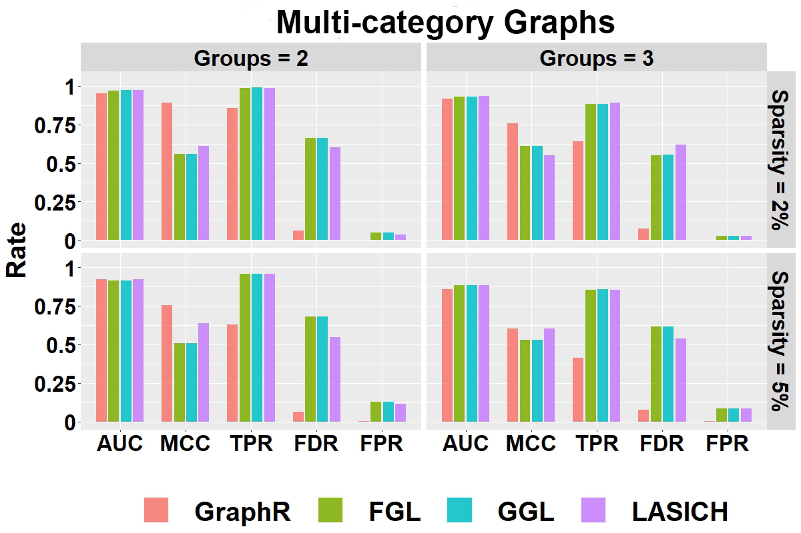
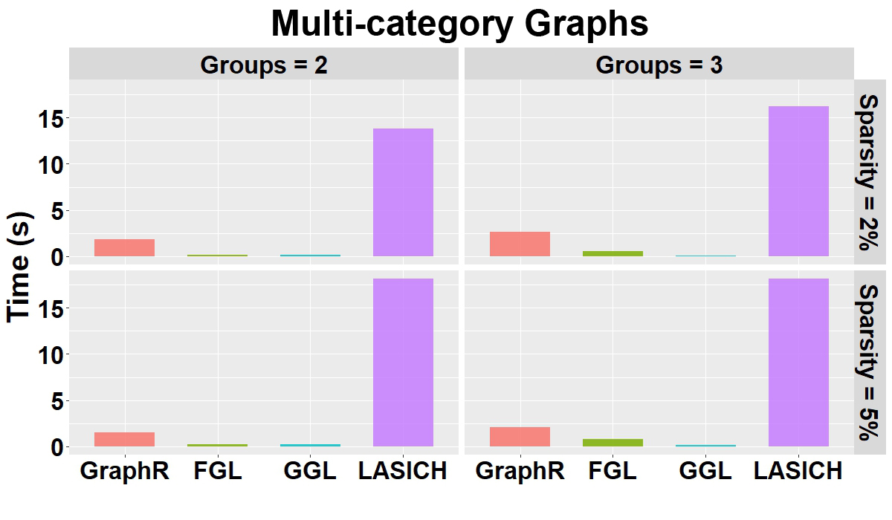
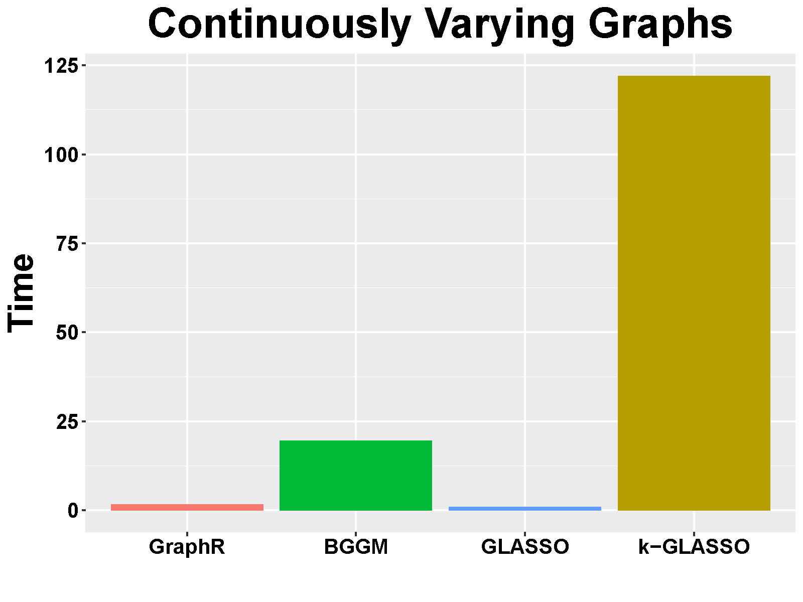
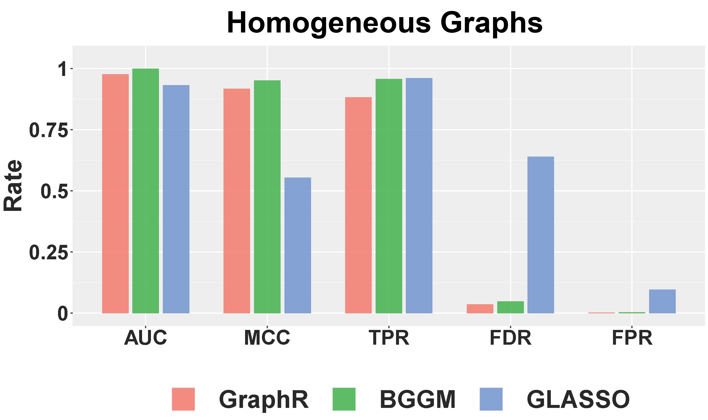
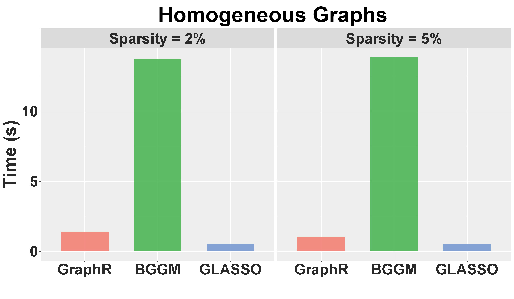
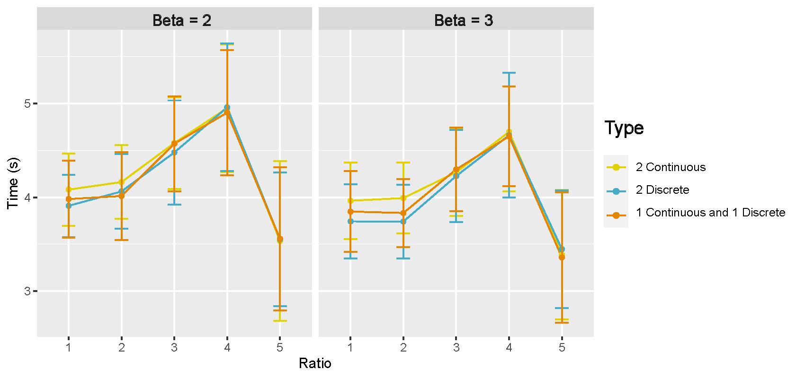
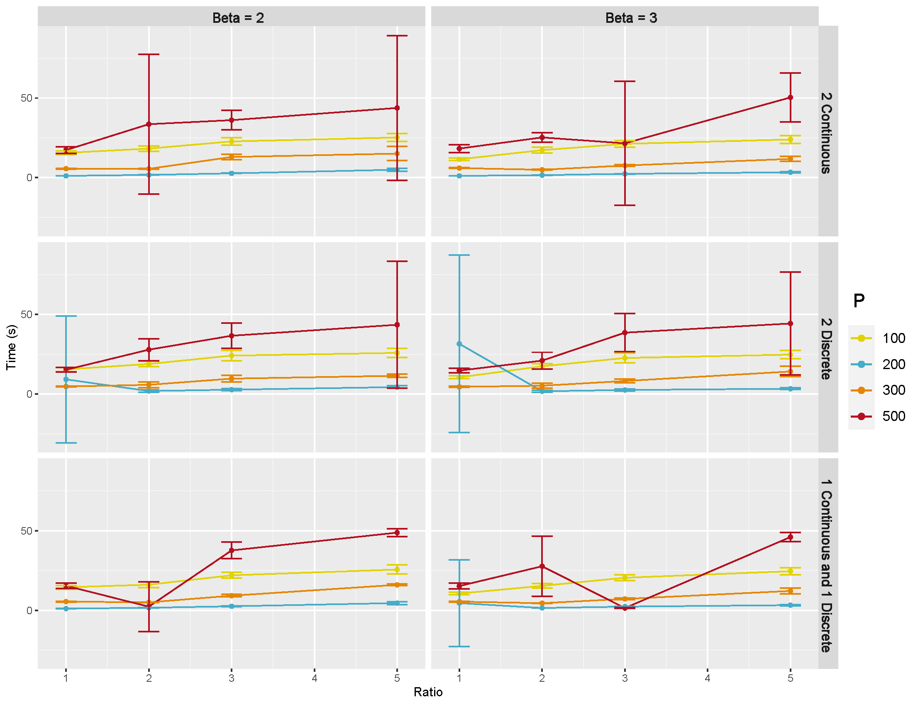
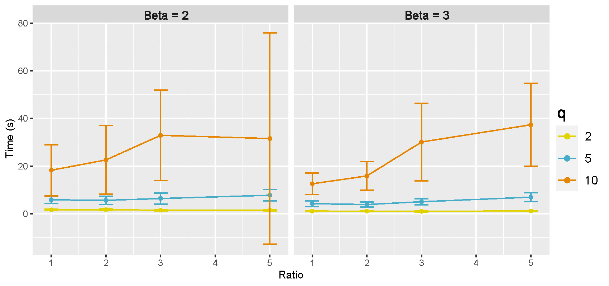

# Simulation studies {#simulation}

```{r, echo=FALSE}
colorize <- function(x, color) {
  if (knitr::is_latex_output()) {
    sprintf("\\textcolor{%s}{%s}", color, x)
  } else if (knitr::is_html_output()) {
    sprintf("<span style='color: %s;'>%s</span>", color,
      x)
  } else x
}
```

<!-- violets are <span style="color:blue">blue</span> -->

<!-- In this Section, we firstly provide details of simulation method for toy example of illustration of Simpson’s paradox in Gaussian graphical models.  -->

In this Section, we provide more simulation results for undirected (Section \@ref(undir)) and directed (Section \@ref(dir)) scenarios with different parameters settings such as: sample size $(n)$, number of nodes $(p)$, number of intrinsic factors $(q)$, type of intrinsic factors, connection probability $(\pi)$, regression coefficients of intrinsic factors $(\beta)$ and etc. We further discuss the simulation study for illustration of Simpson’s paradox in Gaussian graphical models in Section \@ref(simpson). 


## Undirected graphical models {#undir}

**Metrics for comparison:** We use the following measures to compare with other methods (I) true positive rate (TPR); (II) false positive rate (FPR); (III) false discovery rate (FDR); (IV) Matthews correlation coefficient (MCC); (V) the area under the receiver operating characteristic (ROC) curve (AUC). MCC [@matthews1975comparison] measures the quality of binary classification, ranging from +1 (perfect classification) to -1 (total mismatch).

**Comparative methods:** We compare the GraphR method with the following methods (I) Bayesian Gaussian graphical models (BGGM, @mohammadi2015bayesian) (II) graphical lasso (GLASSO, @friedman2008sparse) (III) fused graphical lasso (FGL, @danaher2014joint) (IV) group graphical lasso (GGL, @danaher2014joint) (V) Laplacian shrinkage for inverse covariance matrices from heterogeneous populations (LASICH, @saegusa2016joint) (VI) kernel graphical lasso (K-GLASSO, @liu2010graph).

We run BGGM for 10,000 iterations and discard the first 5,000 as burn-in. The tuning parameters of GLASSO is selected based on a stability approach \cite{liu2010stability}. For FGL, GGL, k-GLASSO and LASICH, approximated Akaike Information Criterion (AIC) is used for the choice of tuning parameters. We set the hyperparameters for the GraphR method as $a_\tau = 0.005, b_\tau = 0.005, a_\pi = 1, b_\pi =4$.

**Posterior inference:** We are interested in the parameter selection on both intrinsic factors and edges level. Point estimators of each model parameters are obtained by using expectation with respect to the approximation of posterior distribution, for example the point estimates $\hat{\pi}_{ijl} =  \int \pi_{ijl} \ \hat{q}(\pi_{ijl})d\pi_{ijl} = E_{\hat{q}}(\pi_{ijl})$. With respect to selection of intrinsic factors, we use posterior inclusion probability (PIP) of intrinsic factors, which are defined as  $\boldsymbol{\hat{p}_{ij}} := [\hat{p}_{ij1},...\hat{p}_{ijq}]^T =  [E_{\hat{q}}(s_{ij1}),...E_{\hat{q}}(s_{ijq})]^T$. For the edge selection between $Y_i$ and $Y_j$, we take both the magnitude of external coefficient $E_{\hat{q}}(\boldsymbol{b}_{ij})$ and PIP of intrinsic factors $E_{\hat{q}}(\boldsymbol{s}_{ij})$ into consideration, and thus define PIP of edges as $\phi_{ij} := \sum_{l=1}^q \left[ \frac{\|E_{\hat{q}}(b_{ijl}s_{ijl}) X_l\|^2}{\sum_{m=1}^q\left(\| E_{\hat{q}}(b_{ijm}s_{ijm}) X_m\|^2\right)} \hat{p}_{ijl} \right]$. In the undirected graphical models, we have $\omega_{ij}(\mathbf{X}) = \omega_{ji}(\mathbf{X})$ due to the symmetric property of precision matrix, implying that $s_{ijl}$ and $s_{jil}$ should be 1 or 0 simultaneously. However we parallelize the regressions which leads to significant increase in time-efficacy and also breaks the dependence between $s_{ijl}$ and $s_{jil}$. Thus $s_{ijl} = s_{jil}$ are not necessarily held during the estimation procedure. To ensure the symmetry of selection indicator, namely $\boldsymbol{s_{ij}} = \boldsymbol{s_{ji}}$, we use a post-processing based approach following the steps from @meinshausen2010stability. We denote $\kappa_{ex}$ and $\kappa_{edge}$ as the threshold of intrinsic factors and edge detection, where intrinsic factors will be selected or conditional dependence exists between edges if the corresponding PIP is larger than  $\kappa_{ex}$ and $\kappa_{edge}$. $\beta_{ijl}$ is non-zero if and only if $\hat{p}_{ijl}^{min} :=  min (\hat{p}_{ijl} , \hat{p}_{jil}) > \kappa_{ex}$. Similarly, in the edge detection, $\phi_{ij}^{min} :=  min (\phi_{ij} , \phi_{ji}) > \kappa_{edge} \Leftrightarrow \text{ edge } \{i,j\}$ exists for $1 \leq i \neq j \leq p$. In terms of the selection of threshold on both external covariate level and edge level, we considered a Bayesian local FDR-based inference approach aiming to control the average Bayesian FDR at some level $\alpha$ (@baladandayuthapani2010bayesian,@morris2008bayesian). Denote the threshold on external covariates or on edges at level $\alpha$ as $\kappa_{ex,\alpha}$ and $\kappa_{edge,\alpha}$ respectively, and denote $q_{ijl} = 1 - \hat{p}_{ijl}^{min}$ and $\tilde{q}_{ij} = 1 - \phi_{ij}^{min}$. Notably, $q_{ijl} = q_{jil}$ and $\tilde{q}_{ij} = \tilde{q}_{ji}$ due to the definition of $\hat{p}_{ijl}^{min}$ and $\phi_{ij}^{min}$. PIPs of external covariates and edges represented that posterior probability that the corresponding external covariates or edges were presented from the model, then $q_{ijl}$ and $\tilde{q}_{ij}$ can be regard as estimates of the local FDR for external covariates and edges, which are also known as Bayesian q-values (@storey2003positive). This statement holds even if we have correlated data (@ji2007bayesian,@baladandayuthapani2010bayesian). Based on q-values of external covariates, $\kappa_{ex,\alpha}$ is determined using follow procedure: (1) sort $\{q_{ijl}\}_{1 \leq i < j \leq p, 1 \leq l \leq q}$ in an ascending order and notated the ordered set as $\{q^{(t)} \}_{1 \leq t \leq p(p-1)q/2}$ (2) Calculate the cumulative mean of $\{q^{(t)} \}$, and find the maximum $t^*$ such that the cumulative mean of $q^{(t^*)}$ is smaller than $\alpha$, a given significance level. (3) Set $\kappa_{ex,\alpha} = 1-q^{(t^*)}$. Similar procedure were proposed when choosing $\kappa_{edge,\alpha}$ by replacing $\{q_{ijl}\}_{1 \leq i < j \leq p, 1 \leq l \leq q}$ with $\{\tilde{q}_{ij}\}_{1 \leq i < j \leq p}$. 


### Multi-category Graphs {#simgroupspec}

**Simulation design:** 
The samples are evenly classified into $q$ groups, and each sample has $q$ discrete intrinsic factors, indicating the group allocations. Graphs for different groups are generated as following: 

(I) Graph of the first group $G_1$ is obtained from a Erdos-Renyi graphs with connection probability being $\pi$. 

(II) $G_q$ is constructed by randomly excluding three existing edges and including three new edges from $G_{q-1}$ for $q \geq 2$. 

(III) The precision matrices and observations in three groups are generated in the same way as step (II) in the homogeneous case.


We **fix** the simulation parameters $n = 151$, $p = 33$ and **vary** (I) $q = 2$ (two group indicators) or $q = 3$ (three group indicators); (II) $\pi$ = 2% or 5%. 

**Selection performance:**
Figure \@ref(fig:groupsele) shows the selection performance of GraphR and comparison methods with respect to multi-category graphs (groups 2 and 3) with different sparsity levels (2% and 5%). Mean values of AUC, MCC, TPR, FPR and FDR based on 50 repetitions are reported. The GraphR method performs the best in terms of MCC while producing very similar performance for TPR like other methods under all the simulation settings mentioned in the simulation design. The proposed method takes a hit on TPR to produce the lowest FDR and FPR than any other methods for all the simulation settings. 

```{r groupsele,echo=F, fig.cap='Selection Performance in multi-category graphs setting with varying number of groups and sparsity.', out.width='90%', fig.asp=0.6, fig.align='center'}

```

**Computation time:**
Figure \@ref(fig:grouptime) shows the mean of computation time in seconds for GraphR and other competing methods w.r.t. 50 replications along with different groups and sparsity levels. GraphR is more computationally efficient than LASICH for all the settings. The LASSO based methods (FGL and GGL) are marginally faster than GraphR but those methods are unable to quantify uncertainty.

```{r grouptime,echo=F, fig.cap='Computation time(s) in group-specific setting with varying number of groups and varying sparsity.', out.width='90%', fig.asp=0.6, fig.align='center'}

```

**Summary:** For the multi-category graph settings, GraphR has marginally similar performance with three comparison methods in terms of AUC. However, in case of other overall performance indicator MCC, GraphR outperforms all other methods. Though GraphR is inferior to comparison methods in TRP, FDR and FPR for GraphR is much lower, which can be viewed as a trade-off. GraphR is also computationally efficient with $<2.5$s computation time on average for all cases.

### Continuously Varying Graphs {#simcont}

**Simulation design:** 
Data are generated based on the assumed model by introducing two continuous intrinsic factors. (I) For $i < j$, 2% of coefficients for continuous intrinsic factors $\beta_{ijl}$ are uniformly chose from -1 or 1 while others are set to be 0. Let the corresponding $\beta_{jil}$ equal to $\beta_{ijl}$. Two continuous intrinsic factors are drawn from Uniform $(-1,1)$. We construct an individual-specific precision matrix $\Omega_n$ by fixing the diagonal entries $\omega_{ii}$ to be 1 and calculating $\omega_{nij} = \sum_{l=1}^2\beta_{nijl}X_{nl}$. (II) Repeat step (I) until $\Omega_n$ is positive definite for all $n$. (III) Generate $y_n$ from $N(0, \Omega_n^{-1})$.  

We set the parameters as $n = 151$, $p = 33$, $q = 2$, $\pi$ = 2%.

**Computation time: **
Figure \@ref(fig:conttime) shows the mean of computation time in seconds of GraphR and comparison methods based on 50 repetitions. 

```{r conttime,echo=F, fig.cap='Computation time(s) in  individual-specific Case.', out.width='50%', fig.asp=0.6, fig.align='center'}

```

**Summary:** Consistent with previous findings, GraphR is computationally efficient than BGGM and k-GLASSO, though takes more computation time than GLASSO. However GLASSO cannot accommodate for heterogenous settings and provide probabilistic reasoning.


### Homogeneous Graphs {#simhomo}

**Simulation design:** 
We assume that all individuals are homogeneous, implying $\Omega_n = \Omega$, $\forall$ $n \in \{1,...,151\}$. We only include one constant effect as the intrinsic factor, and generate data as following: 

(I) Generate a Erdős–Rényi graph G by setting connection probability 2\%. If the edge $\{i,j\}$ are connected in G, then the corresponding off-diagonal entries $\omega_{ij} = \omega_{ji}$ are uniformly drawn from $[-1,-0.5] \cup [0.5,1]$ otherwise $\omega_{ij}$ are set to be 0. The diagonal entries  $\omega_{ii}$ are set to be 1. 

(II) The simulated $\Omega$ from (I) is not necessarily to be positively definite, and thus we will add $0.1I_{33}$ to $\Omega$ until it is positively definite.

(III) Generate 151 independent observations from $N(0, \Omega^{-1})$ and set intrinsic factors to be intercept only. 

We fix the simulation parameters as $n = 151$, $p = 33$, $q = 1$ (intercept only model), $\pi$ = 2% or 5%. 

<!-- **b. Simulation Parameters**  -->

<!-- Fixed: n = 151, p = 33, q = 1 (Intercept only), $\pi$ = 5% -->

**Selection performance:**
Figure \@ref(fig:homosele) shows the selection performance of GraphR and comparison methods by using mean values of AUC, MCC, TPR, FPR and FDR based on 50 repetitions with sparsity being 5%. GraphR performs better than GLASSO except for TPR. BGGM performs marginally better than GraphR in the homogeneous setting. GraphR produces marginally better or at par with reduced level of TPR.    

```{r homosele,echo=F, fig.cap='Selection Performance in homogenuous setting for 5% sparsity level.', out.width='70%', fig.asp=0.6, fig.align='center'}

```

**Computation time:**
Figure \@ref(fig:homotime) shows the mean of computation time in seconds for GraphR and other competitive methods with different levels pf sparsity. The results are based on 50 replications. GraphR is significantly faster than BGGM since GraphR is VB based algorithm whereas BGGM is based on Markov Chain Monte Carlo (MCMC). The frequentist method GLASSO is computationally efficient than GraphR but GLASSO is unable to do the uncertainty quantification.   

```{r homotime,echo=F, fig.cap='Computation times for homogenuous setting with sparsity level at 2% and 5%.', out.width='70%', fig.asp=0.6, fig.align='center'}

```

**Summary:** By design GraphR method is favorable for heterogeneous settings. For the homogeneous setting, GraphR outperforms the frequentist method GLASSO and marginally similar performance with the Bayesian method BGGM at the cost of reduced FDR level. GraphR is computationally efficient than Bayesian methods. The method produces better efficacy rates while enabling uncertainty quantification unlike the frequentist methods. 


## Directed acyclic graphs (DAGs) {#dir}

Here we consider a special case of our GraphR where directions of edges are pre-assumed, leading to a directed acyclic graph model. Three simulation settings are discussed here to illustrate the performance the GraphR method in case of variable selection and scalability for moderate and/or large number of nodes (p) and intrinsic factors (q).

<!-- in which pre-knowledge based directions of edges are assumed, leading to a directed acyclic graph model. -->

**Simulation design:** 
Data is generated as following:

(1) Based on the proposed types of intrinsic factors, we generate continuous intrinsic factors from Uniform(0,1) and discrete intrinsic factors from Bernoulli(0.5). In the settings with large number of intrinsic factors, 70% of intrinsic factors are set to be continuous.

(2) For each external variables, 2% second layer of regression coefficients $\beta_{ij}^{(k)}$ are randomly selected to be non-zero and are set to be 3 when $i > j$. 

(3) The first node ($i=1$) is generated from $N(0,1)$. In terms of $i^{th}$ node $Y_i$ ($i \geq 2$), we standardize $Y_j$ for all $j < i$, and denote these standardized nodes as $\tilde{Y_j}$. Draw $Y_i$ from Normal distribution with mean being $\sum_{j<i}\left[(\beta_{ij}^{(1)}Z^{(1)} + \beta_{ij}^{(2)}Z^{(2)}) \odot \tilde{Y_j} \right]$ and standard deviation being 1.

We use the same 5 metrics (TPR, FPR, FDR, MCC, AUC) to compare across multiple settings and set the hyperparameters $a_\tau = 0.005, b_\tau = 0.005, a_\pi = 1, b_\pi =1$. The probability cutoff is selected to control the Bayesian FDR at 1%.

<!-- **b. Metrics:** (i) true positive rate (TPR); (ii) false positive rate (FPR); (iii) false discovery rate (FDR); (iv) Matthews correlation coefficient (MCC); (v) the area under the ROC curve (AUC).  -->

<!-- **c. Hyperparameters:** $a_\tau = 0.005, b_\tau = 0.005, a_\pi = 1, b_\pi =1$ -->

<!-- The probability cutoff was selected to control the Bayesian FDR at 1%. -->

### Moderate dimensions {#moderate}

**Simulation parameters:** 
We **fix** the simulation parameters $p = 50$, $q = 2$, $\pi$ $= 2\%$ and **vary** the ratio $n/pq = 1,2,3,4,5$ and type of intrinsic factors (discrete/continuous). 

<!-- *Fixed*: p = 50; q = 2; $\pi$ = 2% -->

<!-- *Varied*: n/pq = 1,2,3,4,5; Type of intrinsic factors -->

**Selection performance:**
Figure \@ref(fig:modext) shows the selection performance of intrinsic factors for the GraphR method in DAG where number of nodes and intrinsic factors are moderate. Each column of the panel indicates types of intrinsic factors while each row represent magnitude of $\beta$. Mean values and 95% confidence interval (CI) of AUC, MCC, TPR, FPR and FDR based on 50 repetitions are reported. 

```{r modext,echo=F, fig.cap='Selection performance in terms of intrinsic factors in directed acyclic graphs with moderate setting.', out.width='100%', fig.asp=0.75, fig.align='center'}
knitr::include_graphics("images/moderate_ext.jpg")
```

Figure \@ref(fig:modnode) shows the edge selection performance of GraphR in the DAG setting where number of nodes and intrinsic factors are moderate. All other settings are same as \@ref(fig:modext). 

```{r modnode,echo=F, fig.cap='Selection performance in terms of edges in directed acyclic graphs with moderate setting.', out.width='100%', fig.asp=0.6, fig.align='center'}
knitr::include_graphics("images/moderate_node.jpg")
```

The selection performance of GraphR in terms of intrinsic factors and edges is generally better with increasing effect size ($\beta$) and ratio between $n$ and $pq$. However when $n/pq$ ratio is 5, FDR has is slightly larger than the case when $n/pq$ ratio is 3 or 4, leading to decrease in MCC. One of the potential reason is that estimates are local optimum. Moreover, GraphR tended to perform slightly better with more discrete continuous intrinsic factors when $n/pq$ is not large enough.


**Computation times: **
Figure \@ref(fig:modtime) shows the mean and 95% CI of computation time in seconds for GraphR with different types of intrinsic factors and $n/pq$ ratio. Results are based on 50 repetitions. We observe an increasing pattern till the ratio is 4 and a sudden drop at 5, partly due to the fact that convergence to normality is easier to fulfilled with larger sample size.

```{r modtime,echo=F, fig.cap='Computation time in directed acyclic graphs with moderate setting.', out.width='100%', fig.asp=0.6, fig.align='center'}

```


### Large number of nodes {#largep}
**Simulation parameters: ** 
We **fix** the simulation parameters $q = 2$, $\pi$ $= 2\%$ and **vary** the ratio $n/pq = 1,2,3,5$ (i.e. $p=100, 200, 300, 400, 500$), type of intrinsic factors (discrete/continuous) and magnitude of regression coefficients ($\beta=2,3$). 

<!-- *Fixed*: q = 2; $\pi$ = 2% -->

<!-- *Varied*: p = 100, 200, 300, 500; n/pq = 1,2,3,4,5; Type of intrinsic factors; $\beta = 2$ or $3$ -->

**Selection performance: **
Figure \@ref(fig:highpext) and \@ref(fig:highpnode) show the selection performance of GraphR in terms of intrinsic factors and edges in directed acyclic graphs. Number of nodes are set to be 100, 200, 300 and 500 as shown on the top of each plot. Other settings are same as \@ref(fig:modext) and \@ref(fig:modnode). 

```{r highpext,echo=F, fig.cap='Selection performance in terms of intrinsic factors in directed acyclic graphs with large number of nodes.', out.width='100%', fig.asp=0.6, fig.align='center'}
knitr::include_graphics("images/highp_ext.jpg")
```

```{r highpnode,echo=F, fig.cap='Selection performance in terms of edges in directed acyclic graphs with large number of nodes.', out.width='100%', fig.asp=0.6, fig.align='center'}
knitr::include_graphics("images/highp_node.jpg")
```

Generally, we can observe an increasing trend in AUC, MCC and TPR and decreasing trend in FDR and FPR with larger $n/pq$ ratio and effect size which is similar as the pattern in the moderate setting. However, there are some exception. For example when number of nodes is 500, there is a sudden jump of FDR at $n/pq=3$ with relatively large standard deviation, which also can be reflected the decrease in MCC. This phenomena might be caused by some cases where only local optimum are found.


**Computation times: **
Figure \@ref(fig:highptime) shows the mean and 95% CI of computation time in seconds of GraphR based on 50 repetitions. Each row of panel represent types of intrinsic factors while each column indicates the magnitude of coefficients. Number of nodes are set to be 100, 200, 300 and 500, represented by different colors. In most of the cases, longer computation times are needed when sample size and number of nodes increase.

```{r highptime,echo=F, fig.cap='Computation time in directed acyclic graphs with large number of nodes.', out.width='100%', fig.asp=0.6, fig.align='center'}

```


### Large number of intrinsic factors {#largeq}
**Simulation parameters:** We **fix** the simulation parameters $p = 50$, $\pi$ $= 2\%$, and 70% of intrinsic factors are set to be continuous. We also **vary** the ratio $q = 2,5,10$, $n/pq = 1,2,3,5$ and magnitude of regression coefficients ($\beta=2,3$). 

**Selection performance: **
Figure \@ref(fig:largeqext) and \@ref(fig:largeqnode) show the selection performance of GraphR in terms of intrinsic factors and nodes in directed acyclic graphs. Number of intrinsic factors are set to be 2, 5 and 10 and 70% of covariates are continuous. Other settings are same as \@ref(fig:modext) and \@ref(fig:modnode). 

```{r largeqext,echo=F, fig.cap='Selection performance in terms of intrinsic factors in directed acyclic graphs with large number of intrinsic factors.', out.width='100%', fig.asp=0.6, fig.align='center'}
knitr::include_graphics("images/highq_ext.jpg")
```

```{r largeqnode,echo=F, fig.cap='Selection performance in terms of edges in directed acyclic graphs with large number of intrinsic factors.', out.width='100%', fig.asp=0.6, fig.align='center'}
knitr::include_graphics("images/highq_node.jpg")
```

Similar as previous findings, GraphR performs better with larger $n/pq$ ratio and effect size. Importantly, the accuracy of selection also decreases when q is relatively large, suggesting that higher $n/pq$ is needed in order to ensure the quality of estimation.


**Computation time: **
Figure \@ref(fig:HighqTime) shows the mean and 95% CI of computation time in seconds for GraphR based on 50 repetitions. Number of intrinsic factors are set to be 2, 5 and 10, represented by different colors. 
```{r HighqTime,echo=F, fig.cap='Computation time in directed acyclic graphs with large number of intrinsic factors.', out.width='100%', fig.asp=0.6, fig.align='center'}

```

Computation time increase with larger number of intrinsic factors regardless of the effect sizes. Moreover, variability are also greater when number of intrinsic factors are larger.


## Illustration of Simpson's paradox {#simpson}
**Simulation design:** 
We set overall sample size as 200, number of nodes as 3 and number of groups as 2. Samples are evenly drawn from two groups with distinct conditional independence structures. Generation of precision matrices $\Omega,\tilde{\Omega} \in \mathbb{R}^{3 \times3}$ for the first and the second group is described as follow:

(I) Denote $\Omega = [\omega_{ij}]_{3 \times 3}$. Three diagonal entries are set as 1. For off-diagonal entries, $\omega_{12} = \omega_{21}$ are uniformly drawn from $[0.5,1]$, $\omega_{13} = \omega_{31}$ are uniformly drawn from $[-1, -0.5]$, and $\omega_{23} = \omega_{32}$ are set to be 0. 

(II) Denote $\tilde \Omega = [\tilde \omega_{ij}]_{3 \times 3}$. Three diagonal entries are set as 1. For off-diagonal entries, $\tilde \omega_{12} = \tilde \omega_{21}$ are uniformly drawn from $[-1, -0.5]$, $\tilde \omega_{23} = \tilde \omega_{32}$ are uniformly drawn from $[0.5,1]$, and $\tilde \omega_{13} = \tilde \omega_{31}$ are set to be 0. 

Repeat (I) and (II) until both $\Omega,\tilde{\Omega}$ are positive definite matrices.

Generate 100 observations from $N(0, \Omega^{-1})$ and 100 observations from $N(0, \tilde \Omega^{-1})$, and set intrinsic factors to be intercept only for homogeneous case and to be group indicators for heterogeneous case.


