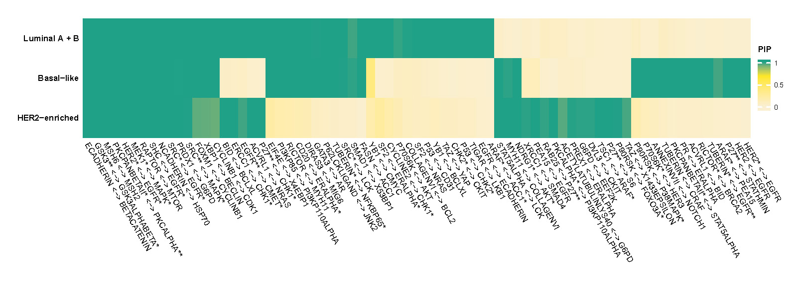
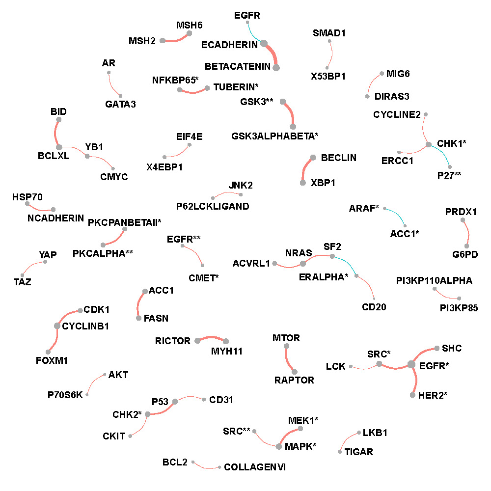
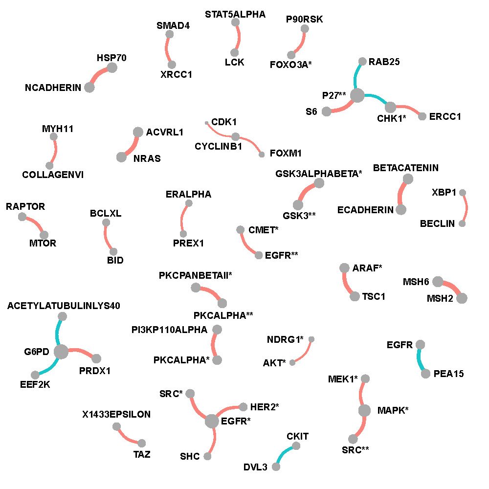
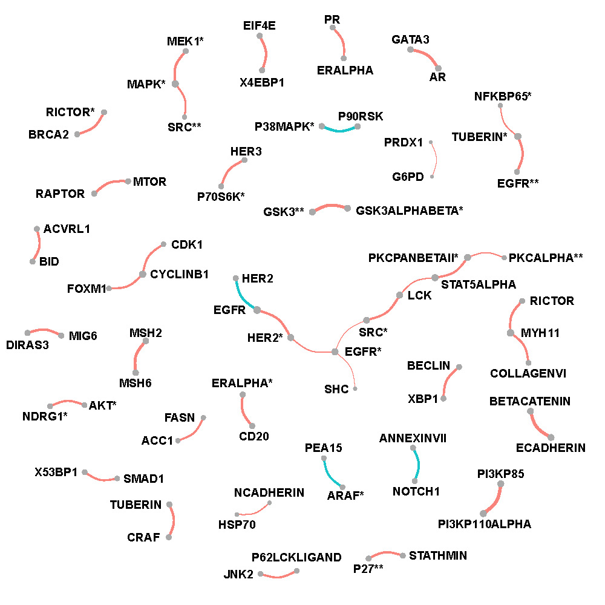

# PAM50 proteomics dataset {#PAM50}


## Data description {#PAM50data}

The PAM50 [@parker2009supervised] proteomics dataset was obtained from The Cancer Genome Atlas (TCGA, @weinstein2013cancer) and The Cancer Proteome Atlas (TCPA,@li2013tcpa). Reverse Phase Protein Arrays (RPPAs) were used to quantify 190 proteins or phosphoproteins which were involved in apoptosis, DNA damage response, cell cycle [@akbani2014pan] over 859 breast cancer (BRCA) patients where normal-like BRCA patients are excluded due to small sample sizes. BRCA of Luminal A and Luminal B are combined in one category to achieve higher power which leads to three groups with 626 BRCA patients in Luminal A and B, 75 patients in Her2-enriched and 158 in Basal-like. 

## Preprocessing and application {#PAM50process}

Proteomics data is standardized before applying GraphR. The indicators for cancer subtype (Luminal A+B, Her2-enriched and Basal-like breast cancers) are used as intrinsic factors. 

<!-- Three intrinsic factors: indicators of Luminal A+B, Her2-enriched and Basal-like breast cancers are included in the analyses. -->

We set hyperparameters as follows: $a_\tau = b_\tau = 0.005,a_\pi = 1,b_\pi=4$. Notably, in case of integrated functional pathway analysis, we change the hyper-parameters: $a_\pi = b_\pi = 0.05$. This provides us potential to consider high density of connections between proteins in the same pathway. 

Moreover, we here only include proteins pairs belonging to different isoforms while showing significantly strong correlation (FDR based p-values $<0.01$ and magnitude $\mid \rho \mid \geq 0.4$) for at least one group, allowing plots to be more readable. 

<!-- Names of isoforms of protein can be found XXX (Question: how to add link to an excel file?) -->

<!-- <span style="color:blue"> -->
<!-- Here are some of the following options to upload the excel file.  -->
<!-- 1) upload it on github under GraphR package under a different folder -->
<!-- 2) upload the excel file on your own github directory -->
<!-- 3) if the excel file already exits somewhere then use that link. -->
<!-- Next the link to the excel file or webaddess can be added [here](link of the website). -->
<!-- </span> -->

## Results {#PAM50result}

Figure \@ref(fig:pampip) shows heatmap of posterior inclusion probability (PIP) of selected edges in each PAM50 subtype of BRCA. 

```{r pampip,echo=F, fig.cap='Posterior inclusion probability (PIP) of selected edges in each PAM50 subtype of BRCA.', out.width='95%', fig.asp=0.7, fig.align='center'}

```


Figure \@ref(fig:lumfullnet), \@ref(fig:herfullnet) and \@ref(fig:basalfullnet) show networks of selected protein pairs in Luminal A+B, Her2-enriched and Basal-like BRCA respectively. The widths of edges are proportional to partial correlations. The sizes of nodes are proportional to connectivity degrees which are defined as the sum of magnitudes of the partial correlations. Sign of partial correlations are represented by color with red being positive and blue being negative.

**Luminal A +  B breast cancer**

```{r lumfullnet,echo=F, fig.cap='Network of selected protein pairs in Luminal A +  B breast cancer patients.', out.width='70%', fig.asp=0.6, fig.align='center'}

```

**Her2-enriched breast cancer**

```{r herfullnet,echo=F, fig.cap='Network of selected protein pairs in Her2-enriched breast cancer patients.', out.width='70%', fig.asp=0.6, fig.align='center'}

```

**Basal-like breast cancer**

```{r basalfullnet,echo=F, fig.cap='Network of selected protein pairs in Basal-like breast cancer patients.', out.width='70%', fig.asp=0.6, fig.align='center'}

```
