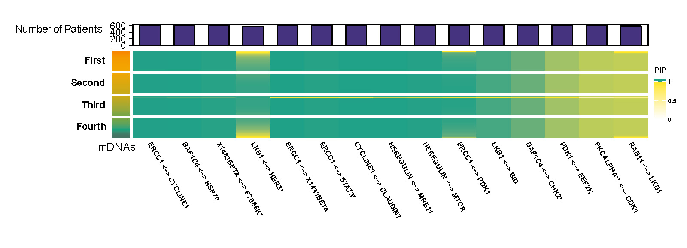
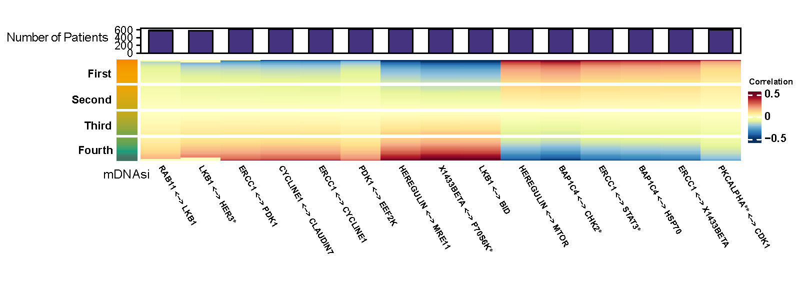
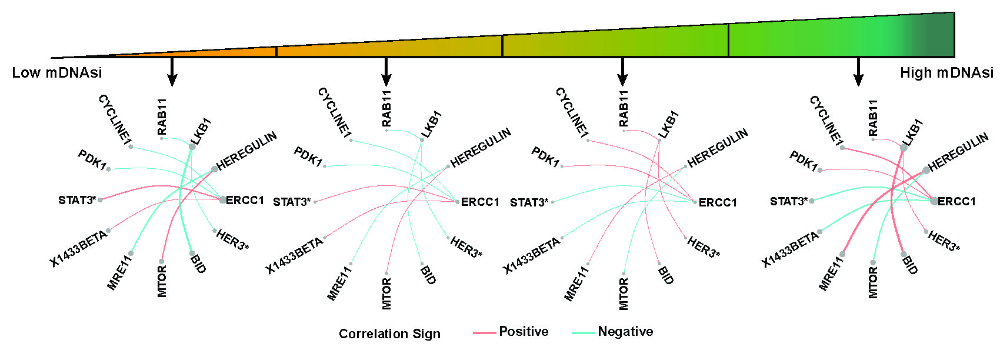
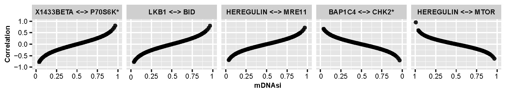
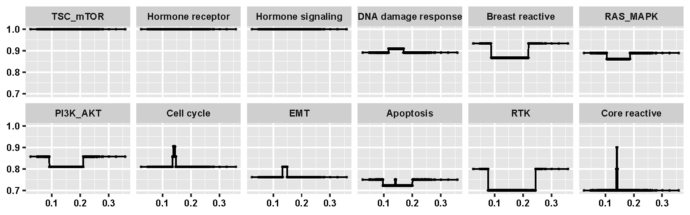

# Stemness-induced proteomics dataset {#StemnessBC}

## Data description {#StemnessBCdata}

The dataset comes from The Cancer Genome Atlas (TCGA, @weinstein2013cancer) and the Cancer Proteome Atlas (TCPA, @li2013tcpa), and is processed by @malta2018machine to derive two independent stemness indices based on DNA methylation (mDNAsi) and mRNA expression (mRNAsi). Aim to provide the degrees of dedifferentiation on epigenetic and gene expression level, mDNAsi and mRNAsi range from 0 to 1 with lower values implying tendency to normal-like cells. 189 protein abundance are measured across 616 breast cancer (BRCA) from TCGA [@weinstein2013cancer] and can be downloaded from the NIH Genomic Data Commons (GDC) [website](https://gdc.cancer.gov/about-data/publications/PanCanStemness-2018). 

## Preprocessing and application {#StemnessBCprocess}

The mRNAsi, mDNAsi and patients' ages are treated as three intrinsic factors. Logit transformation is used to the stemness indices to ensure the same scale as age, and all three intrinsic factors and proteomics data are standardized before plugging into the model. Hyperparameters are set as previous section \@ref(PAM50process).

Here we present proteomics data analysis with mDNAsi in breast cancers where mRNAsi and patients' age are set to be median, and mRNAsi related result can be found in the Result Section. For mDNAsi case, we limit the protein connections by using the following criteria

(1) proteins pair with different isoforms, 

(2) significant correlation (FDR based p-values $<$ $0.01$) in more than half of the cases, 

(3) the magnitude of correlations exceeded $0.2$ for at least one case. 

## Results {#StemnessBCresult}
Figure \@ref(fig:mdnasipip) and \@ref(fig:mdnasicor) are two heatmaps which show posterior inclusion probability (PIP) and partial correlation of selected edges with varying mDNAsi while mRNAsi and age are set to be median. The color bar on the left shows quarterly divided mDNAsi. The barplot on top represents the number of significant cases for the corresponding protein pair. 

```{r mdnasipip,echo=F, fig.cap='Posterior inclusion probability (PIP) of selected edges with varying mDNAsi and median value of mRNAsi and age.', out.width='90%', fig.asp=0.6, fig.align='center'}

```

```{r mdnasicor,echo=F, fig.cap='Partial correlation of selected edges with varying mDNAsi and median value of mRNAsi and age.', out.width='90%', fig.asp=0.6, fig.align='center'}

```


Figure \@ref(fig:mdnasinet) presents networks for proteins with top five connectivity degrees corresponded to each quarter of mDNAsi. The width of edges are proportional to the median value of partial correlation between selected protein pairs for each quarter of mDNAsi. The node sizes reflects median values of connectivity degrees. 

```{r mdnasinet,echo=F, fig.cap='Networks for proteins with top five connectivity degrees corresponded to each quarter of mRNAsi.', out.width='90%', fig.asp=0.6, fig.align='center'}

```


As shown in Figure \@ref(fig:mdnasiline) we also present changes of correlation along with mDNAsi of the original scale for selected protein pairs when mRNAsi and age are fixed to be median.

```{r mdnasiline,echo=F, fig.cap='Line plots of selected protein pairs showing changes of correlation along with mDNAsi of the original scale.', out.width='90%', fig.asp=0.6, fig.align='center'}

```


Finally, the results based on integrated functional analysis of pathways are shown in \@ref(fig:mdnasipathway). This plot illustrates the changing patterns of connectivity scores of pathways along with mDNAsi of the origin scale.


```{r mdnasipathway,echo=F, fig.cap='Changing patterns of connectivity scores for pathways along with mDNAsi of the origin scale.', out.width='90%', fig.asp=0.6, fig.align='center'}

```


