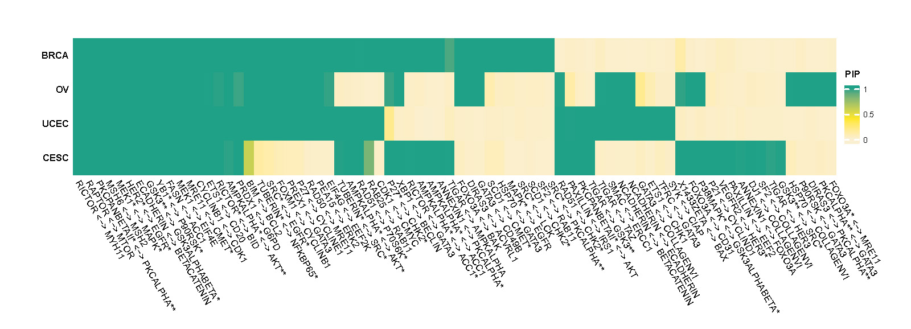
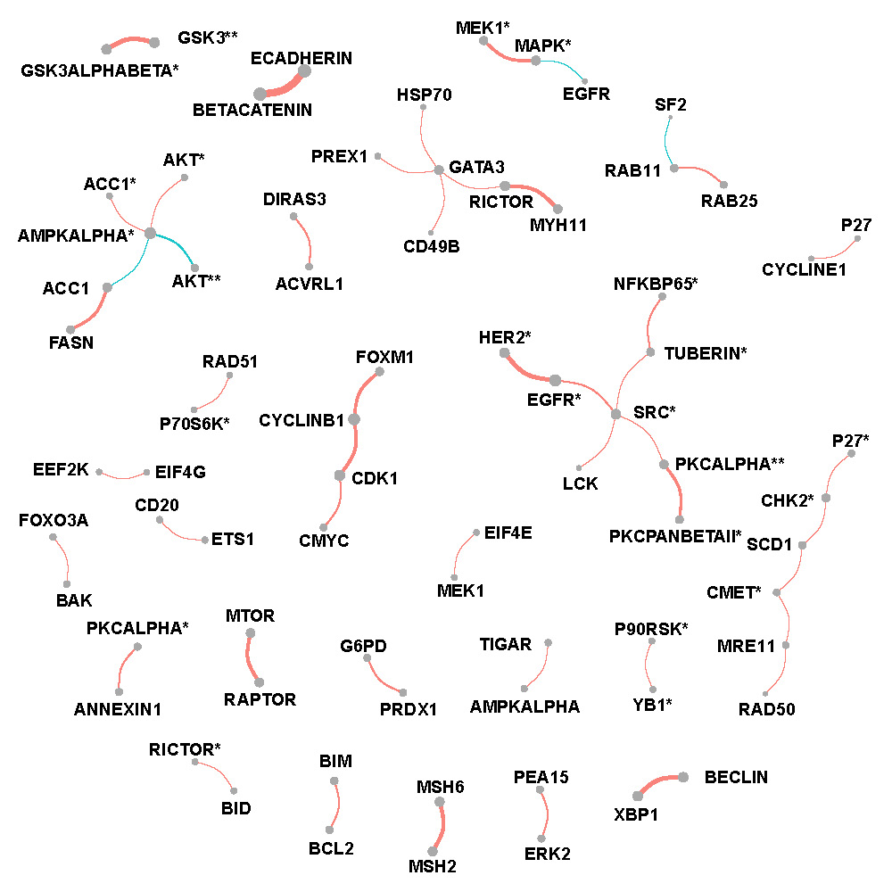
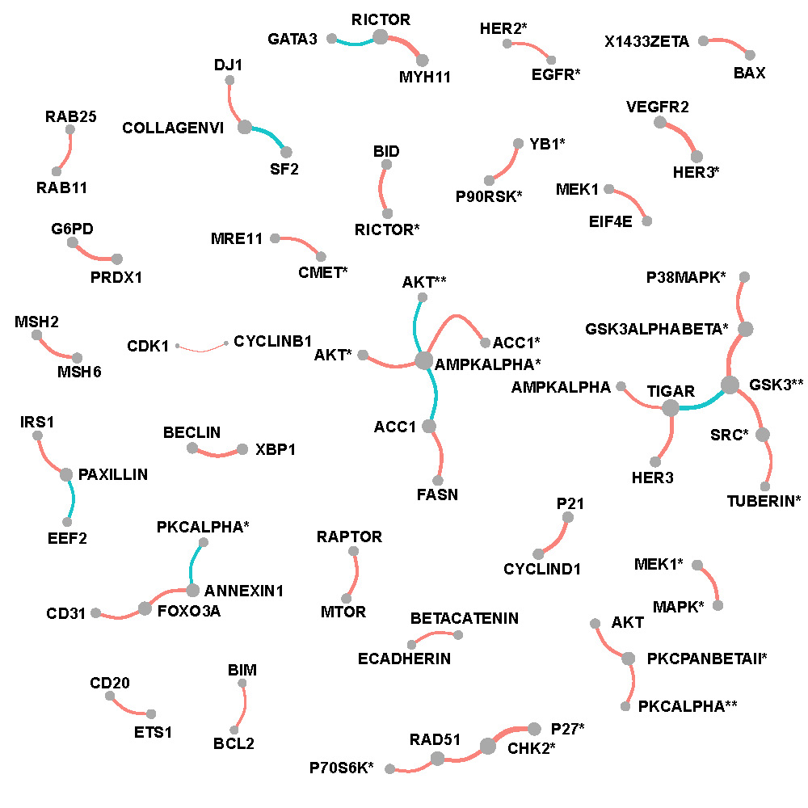
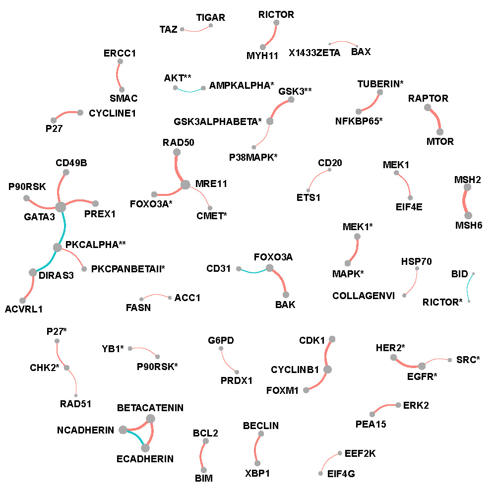
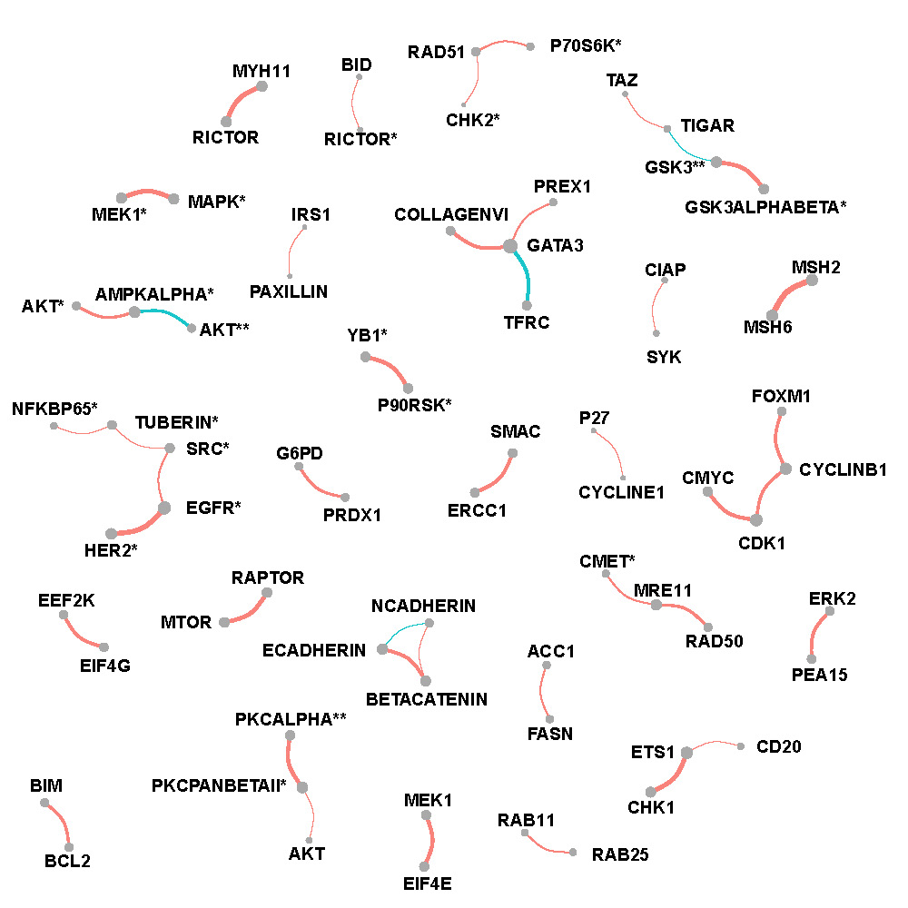

# Gynecological and breast cancers data {#Gyne}

## Data description {#Gynedata}

The Gynecological and breast cancer (Pan-gyane) proteomics dataset was obtained from The Cancer Genome Atlas (TCGA, @weinstein2013cancer) and The Cancer Proteome Atlas (TCPA, @li2013tcpa). The Pan-gyane proteomics contains four types of cancers including breast invasive carcinoma (BRCA), cervical squamous cell carcinoma and endocervical adenocarcinoma (CESC), ovarian serous cystadenocarcinoma (OV) and uterine corpus endometrial carcinoma (UCEC). Abundance of 189 kinds of protein were measured across 1,941 patients from @weinstein2013cancer among which 892 patients had BRCA, 173 had CESC, 436 had OV and 440 had UCEC.


## Preprocessing and application {#Gyneprocess}

All settings are same as in Section \@ref(PAM50process), except that:

(I) Four intrinsic factors: indicators of BRCA, CESC, OV, UCEC are included in the analyses.

(II) Significantly strong correlation is defined as connection with FDR based p-values $<0.01$ and magnitude $\mid \rho \mid \geq 0.4$)


## Results {#Gyneresult}
Figure \@ref(fig:panpip) is a heatmap which shows posterior inclusion probability (PIP) of selected edges in each type of cancer.

```{r panpip,echo=F, fig.cap='Posterior inclusion probability (PIP) of selected edges in each type of cancer.', out.width='90%', fig.asp=0.6, fig.align='center'}

```


Figure \@ref(fig:brcafullnet), \@ref(fig:cescfullnet), \@ref(fig:ovfullnet) and \@ref(fig:ucecfullnet) show networks of selected protein pairs in BRCA, CESC, OV and UCEC respectively. All other settings are same as figure \@ref(fig:lumfullnet)

**BRCA**

```{r brcafullnet,echo=F, fig.cap='Network of selected protein pairs in BRCA patients.', out.width='70%', fig.asp=0.6, fig.align='center'}

```

**CSEC**

```{r cescfullnet,echo=F, fig.cap='Network of selected protein pairs in CESC patients.', out.width='70%', fig.asp=0.6, fig.align='center'}

```

**OV**

```{r ovfullnet,echo=F, fig.cap='Network of selected protein pairs in OV patients.', out.width='70%', fig.asp=0.6, fig.align='center'}

```

**UCEC**

```{r ucecfullnet,echo=F, fig.cap='Network of selected protein pairs in UCEC patients.', out.width='70%', fig.asp=0.6, fig.align='center'}

```
