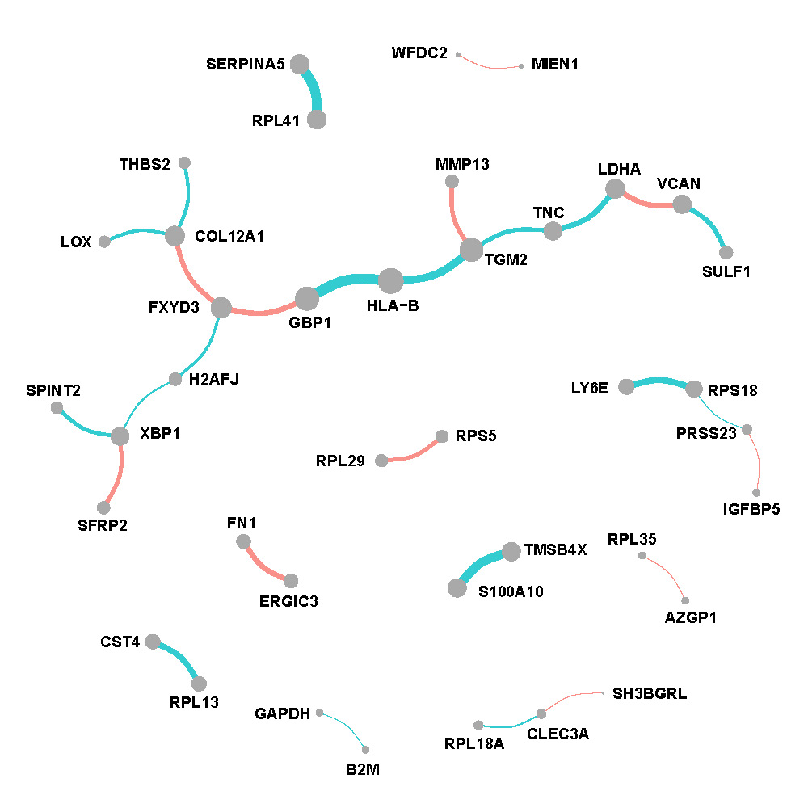
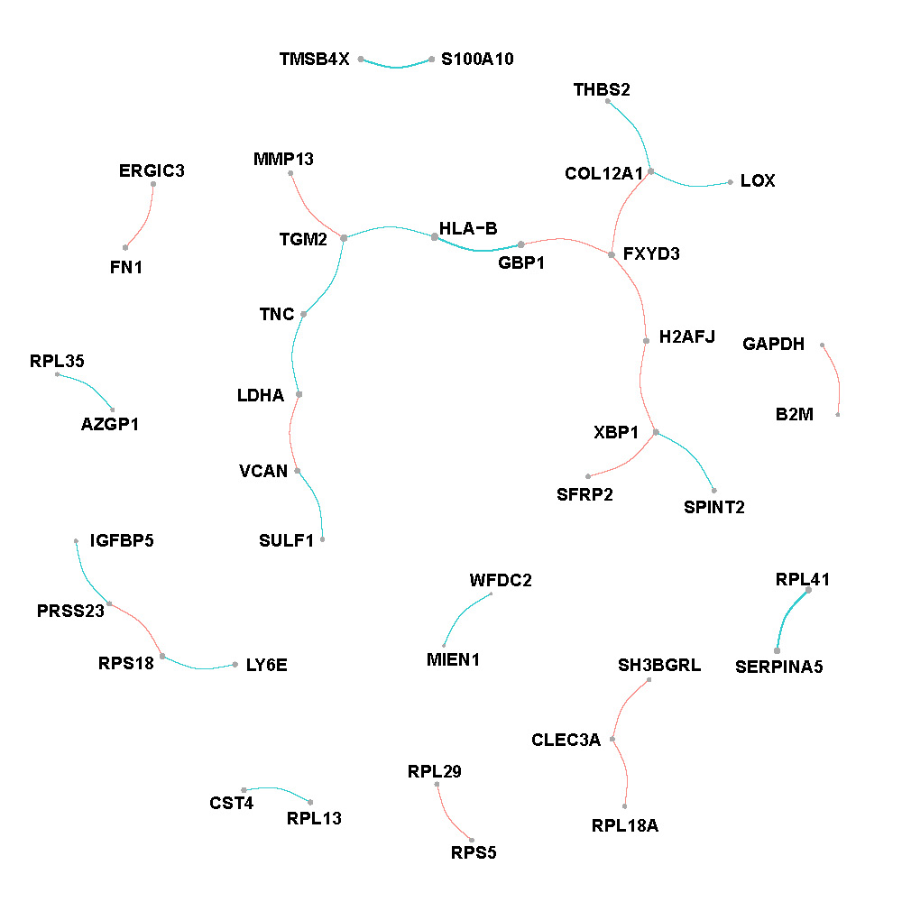
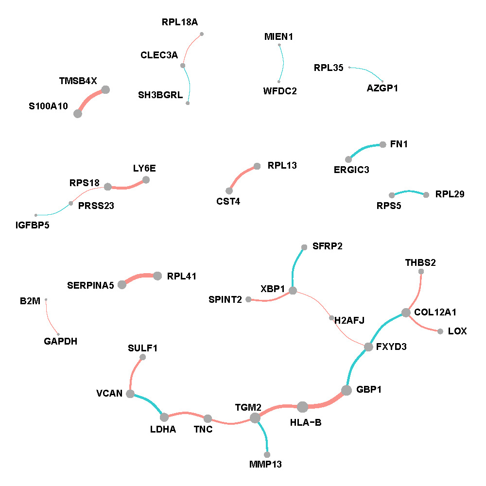
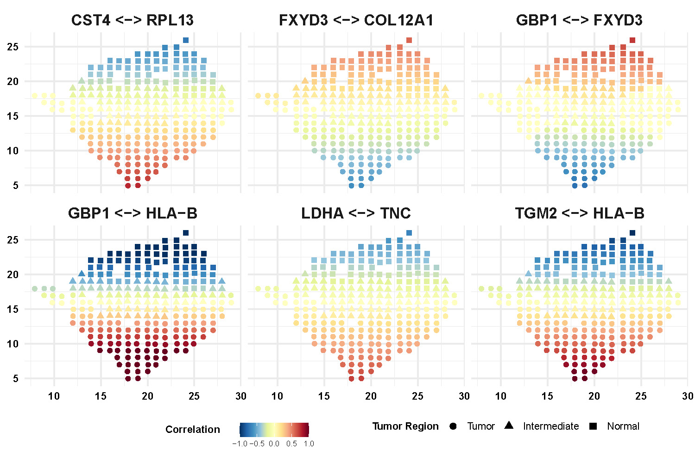
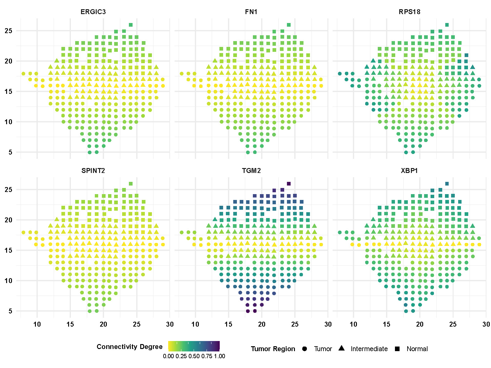

# Spatial transcriptomics dataset {#ST}

## Data description {#STdata}
The human breast cancer data was collected from biopsy of breast cancer at a thickness of 16 $\mu$m [@staahl2016visualization]. Based on the Hematoxylin and Eosin (H\&E) staining image, locations can be classified into three spatial regions as tumor, intermediate, and normal with the sizes 114, 67, and 69 spots respectively. The data includes measurement of 5262 genes expression at 250 spot locations.


## Preprocessing and application {#STprocess}
Here we only consider the 100 spatially expressed genes with the lowest Benjamini-Hochberg (BH) adjusted p-value by applying SPARK method [@sun2020statistical]. Next, we apply the PQLseq [@sun2019heritability] algorithm to adjust for the covariate effect and obtain the latent gene expressions which follow Normal distribution. 

Two coordinates are scaled and treated as intrinsic factors in the GraphR model. Hyperparameters are set as previous section \@ref(PAM50process). We include correlations with FDR based p-values $<0.01$ in the results. 

## Results {#STBCresult}
Suppose the partial correlations between gene $i$ and gene $j$ and the corresponding posterior inclusion probabilities are vectors of length $n_1+n_2+n_3$ with $n_1,n_2,n_3$ representing number of spots in tumor, intermediate and normal region, namely
\begin{equation}
\begin{split}
& \rho_{ij} = [\rho_{ij}^{tumor}, \rho_{ij}^{inter}, \rho_{ij}^{normal}] \in \mathbb{R}^{n_1+n_2+n_3}, \\
& PIP_{ij} = [PIP_{ij}^{tumor}, PIP_{ij}^{inter}, PIP_{ij}^{normal}] \in \mathbb{R}^{n_1+n_2+n_3}.
\end{split}
\end{equation}
We define weighted average of partial correlations between gene $i$ and gene $j$ in a region as $\hat{\rho}_{ij}^{region}= (\sum_{region} \rho_{ij}^{region} * PIP_{ij}^{region})/n_{region}$ where region can be tumor, intermediate or normal. Weighted connectivity degree of gene $i$ is defined as the sum of $|\hat{\rho}_{i\cdot}|$.

Figure \@ref(fig:STtumornet), \@ref(fig:STinternet) and \@ref(fig:STnormalnet) show networks w.r.t. each spatial regions. The edges are proportional to the weighted average of partial correlations and nodes are proportional to the weighted connectivity degrees.

**Tumor region**

```{r STtumornet,echo=F, fig.cap='Network of tumor region in breast cancer.', out.width='70%', fig.asp=0.6, fig.align='center'}

```

**Intermediate region**

```{r STinternet,echo=F, fig.cap='Network of intermediate region in breast cancer.', out.width='70%', fig.asp=0.6, fig.align='center'}

```

**Normal region**

```{r STnormalnet,echo=F, fig.cap='Network of normal region in breast cancer.', out.width='70%', fig.asp=0.6, fig.align='center'}

```


We also display more spatial patterns of partial correlations (Figure \@ref(fig:STcorloc)) and connectivity degrees (Figure \@ref(fig:STdegreeloc)) for gene and gene pairs. The color bar indicates the values of correlations and connectivity degrees while shapes of point representing the spatial region.

```{r STcorloc,echo=F, fig.cap='Spatial pattern of partial correlations for selective gene pairs.', out.width='70%', fig.asp=0.6, fig.align='center'}

```


```{r STdegreeloc,echo=F, fig.cap='Spatial pattern of connectivity degrees of selective genes.', out.width='70%', fig.asp=0.6, fig.align='center'}

```


