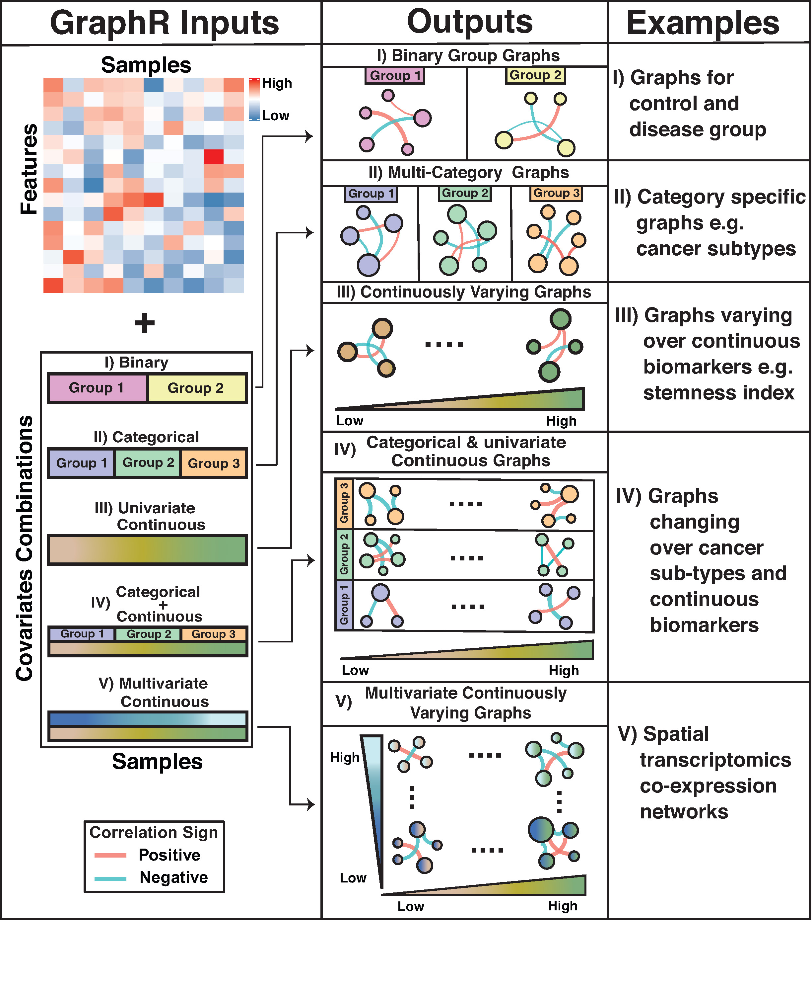

--- 
title: "Supplementary Materials for Probabilistic Graphical Modeling under Heterogeneity"
author: Liying Chen$^{1,5}$, Satwik Acharyya$^{1,5}$, Chunyu Luo$^{2,3}$,
        Yang Ni$^4$ and Veerabhadran Baladandayuthapani$^{1,6}$ 
date: $^1$Department of Biostatistics, University of Michigan, <br />
      $^2$Department of Statistics, University of Michigan, <br />
      $^3$Department of Electrical Engineering and Computer Science, University of Michigan, <br />
      $^4$Department of Statistics, Texas A&M University  <br /> <br />
      $^5$These authors contributed equally. <br /> 
      $^6$Corresponding author$:$ veerab@umich.edu
site: bookdown::bookdown_site
output: bookdown::gitbook
documentclass: book
bibliography: [packages.bib]
biblio-style: apalike
link-citations: yes
github-repo: rstudio/bookdown-demo
description: "This containes all the supplementary materials for the paper named Probabilistic Graphical Modeling under Heterogeneity."
number_sections: true
---

# (APPENDIX) Supplementary Materials {-}
# Introduction {-}

Network modeling are widely used in biomedical research, aiming to estimate and visualize complicated dependency structures in various fields and at different level. Graphically, networks compromise a set of variables (nodes) and relationships among nodes which are referred as edges. Under the assumption that: (1) edges represent partial correlation between nodes; (2) nodes follow Gaussian distribution, leading to a Gaussian graphical models (GGM, @lauritzen1996graphical). GGM can be represented as a multivariate Gaussian distribution, usually with a sparse precision matrix of which a zero entry is equivalent to conditional independence. Most current probabilistic GGM-based methods assume homogeneous samples which limits the applicability of these models to incorporate heterogeneity across samples that is routinely present in many scientific contexts. We propose a flexible and computationally efficient approach called Graphical Regression (GraphR) which allows for covariate-dependent graphs and enables incorporation of sample heterogeneity. The Figure below provides an overview of the GraphR method.  

<center></center>

Here we provide supplementary materials for Probabilistic Graphical Modeling under Heterogeneity, which are organized as following:

1. In Section \@ref(method), we provide a detailed introduction for mean-field variational Bayes method and the derivation of the methodology.
2. In Section \@ref(simulation), additional simulation results for undirected and directed settings are discussed. 
3. In Section \@ref(PAM50), we present the additional results from the PAM50 protemoics dataset. 
4. In Section \@ref(StemnessBC), more results from stemness and age based breast cancer data are provided.  
5. In Section \@ref(Gyne), we added further analysis from pan-gynecological breast cancer data.
6. In Section \@ref(ST), additional results from from spatial transcriptomics breast cancer data are presented. 
7. In Section \@ref(ImplementGraphR), we layout the implementation related details of the GraphR package.
 
<!-- ``r Sys.Date()`` -->

<!-- **All references will go to the packages.bib file.** -->

<!-- ```{r induceCORR,echo=F, fig.cap='Induced correlation plot for the Merfish data', out.width='80%', fig.asp=0.6, fig.align='center'} -->
<!-- knitr::include_graphics("Images/nice-fig-1.png") -->
<!-- ``` -->

